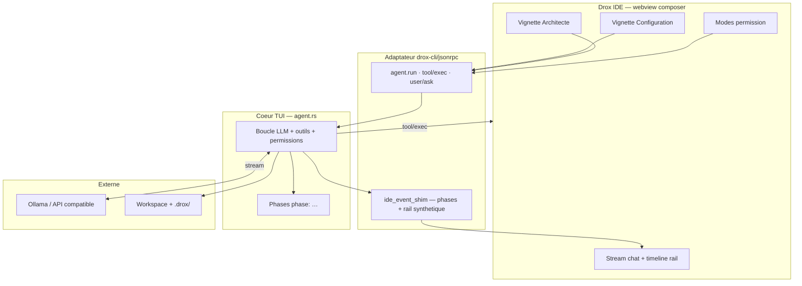
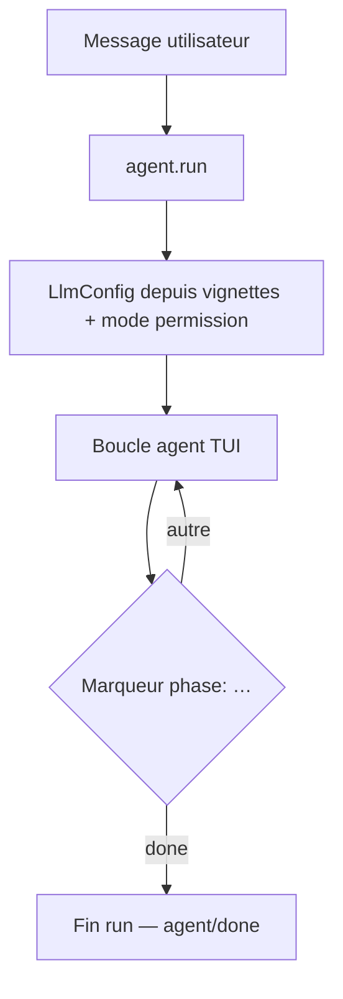
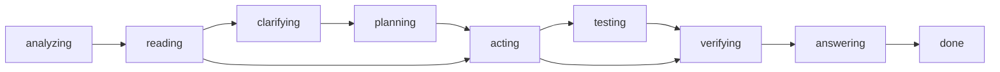
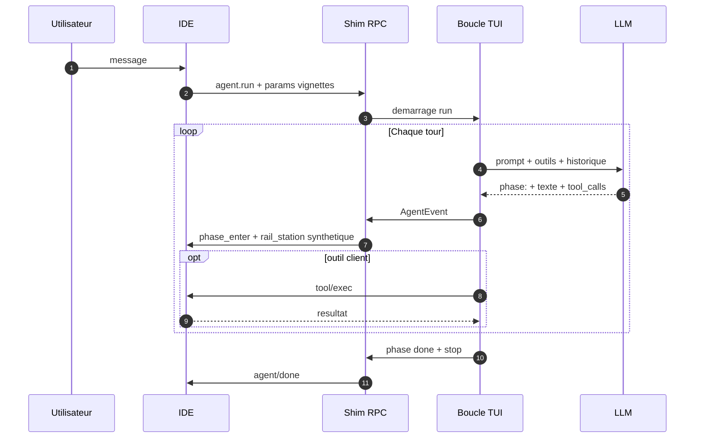
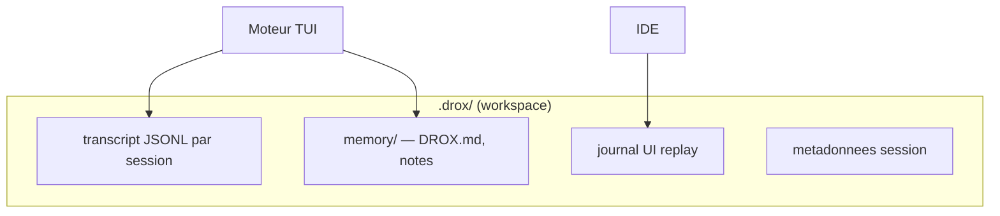

# Drox IDE — releases officielles

> ⚠️ **Avertissement** — Drox est **potentiellement instable** : développement **actif**, produit encore **expérimental**. Release courante [**1.5.10**](https://github.com/DroxKiwi/Drox---IDE---OR/releases/latest) (Windows **1.5.10** · Linux **1.5.9**). Branche dev **1.5.11** · chantiers MCP / Agents Window reportés ([brainstorm](https://github.com/DroxKiwi/Drox---IDE/blob/main/drox-engine/docs/feature-brainstorm/README.md)). Utiliser les [releases](https://github.com/DroxKiwi/Drox---IDE---OR/releases/latest) et s’attendre à des évolutions fréquentes.
>
> ⚠️ **Warning** — Drox may be **unstable**: **active development**, still **experimental**. Current release [**1.5.10**](https://github.com/DroxKiwi/Drox---IDE---OR/releases/latest) (Windows **1.5.10** · Linux **1.5.9**). Dev branch **1.5.11** · MCP / Agents Window deferred ([brainstorm](https://github.com/DroxKiwi/Drox---IDE/blob/main/drox-engine/docs/feature-brainstorm/README.md)). Use [releases](https://github.com/DroxKiwi/Drox---IDE---OR/releases/latest) and expect frequent changes.

## But du projet — souveraineté et feuille de route

### Où en est Drox (1.5.x)

Le projet est en phase de **stabilisation de la base moteur 1.5.0** (`tui_mono`) et de **polish UX chat**. La release courante [**1.5.10**](https://github.com/DroxKiwi/Drox---IDE---OR/releases/latest) apporte le **run recovery** toujours disponible (Reprendre / Recommencer), le **respawn moteur différé** et les **métriques tokens live**. **Windows** est en **1.5.10** ; **Linux** `.deb` reste en **1.5.9** le temps du prochain ship Linux. Signature Authenticode Windows reste à venir. Toujours **expérimental** — pas un IDE agent de production.

### Souveraineté

Drox vise la **souveraineté numérique** : IDE et moteur agent en local, LLM via **Ollama** (ou API que tu configures), données de session dans **`.drox/`** sur ton disque — pas de compte cloud KDDS obligatoire, pas de télémétrie Microsoft dans l’installeur.

**Seule exception réseau** : la **vérification de version** (lecture de `stable/latest.json` sur ce dépôt) pour proposer une MAJ si une release plus récente existe. Rien d’autre n’est requis pour coder avec l’agent.

### Vision produit

L’objectif est de **maîtriser des projets volumineux** avec une **IA légère** (modèles locaux ou petits modèles distants) — peu gourmande en RAM/VRAM et en tokens. Le moteur privilégie la compréhension d’abord (carte du repo, parcours des fichiers), l’action ensuite, avec **observabilité locale** pour garder la main sur le système.

### Pistes à venir (brainstorm)

Fiches d’intention dans le dépôt sources [Drox---IDE](https://github.com/DroxKiwi/Drox---IDE) — [index brainstorm](https://github.com/DroxKiwi/Drox---IDE/blob/main/drox-engine/docs/feature-brainstorm/README.md) :

| Thème | Objectif |
|-------|----------|
| **Télémétrie locale** | KPI par run/cycle, dashboards **100 % locaux** (`.drox/`) — aucun cloud |
| **Cartographie & parcours fichiers** | Vue graphe du parcours modèle ; rôles « compréhension » avant mutation |
| **IA légère & perf** | Réponses rapides sans sur-planifier ; backends distincts par rôle |
| **Sessions & long run** | Gros chantiers multi-heures ; reprise historique progressive |
| **Réglages & confiance** | Strictesse prompts, benchmark matériel/modèle, persona onboarding |
| **IDE & transparence** | Preview web, chassis Agents Window Drox, sortie shell live |

Ces pistes **ne bloquent pas** les releases courantes ; elles nourrissent la ligne **1.5.x+** et au-delà.

---

## ⚠️ STATUT — version 1.5.10 (juin 2026)

> **Drox 1.5.10** : **run recovery** toujours sur le dernier message user (y compris après reload), **respawn moteur différé** pendant un run, **métriques tokens live**, padding composer — moteur **`tui_mono`** (1.5.0) inchangé.  
> Toujours **expérimental** — pas un IDE agent de prod.

| | |
|---|---|
| **Version** | [**1.5.10**](https://github.com/DroxKiwi/Drox---IDE---OR/releases/latest) (juin 2026) · socle VS Code **1.127.0** |
| **Plateformes** | **Windows** installeur **1.5.10** · **Linux** `.deb` amd64 **1.5.9** (Ubuntu 22.04 / 24.04) |
| **Utilisable au quotidien ?** | **Non** — early adopters / dogfood. |
| **Nouveautés 1.5.10** | Recovery persistante · respawn différé · métriques live · padding composer. |
| **1.5.9** | Scroll stick-to-bottom · reset `MEMORY.md` · composer épuré. |
| **1.5.8** | Native thinking Reasoning · fil Work chronologique · Planifier · warmup fil · padding ask_user. |
| **1.5.7** | Reprise après erreur LLM · smart paste · rejeu session. |
| **1.4.x** | **Obsolète** — ne plus documenter ni bâtir dessus. |

**En bref** : *lire le fil à son rythme pendant un run ; reset workspace plus complet ; UI composer plus légère.*

---

## Drox TUI — plus simple pour débuter

Tu découvres Drox ? Commence par le **terminal** : **[Drox TUI — releases officielles](https://github.com/DroxKiwi/Drox---TUI---OR)**.

| | **Drox TUI** | **Drox IDE** (cette page) |
|---|--------------|---------------------------|
| **Interface** | Terminal (`drox-tui`) | Éditeur VS Code + chat |
| **Prise en main** | **Plus légère** — install rapide, pas de gros IDE | LSP, diffs éditeur, wizard connexion |
| **Moteur** | **`tui_mono`** (cœur agent) | Même moteur (`drox.exe` + shim) |

Même boucle agent, mêmes backends LLM (Ollama, vLLM…). Le TUI suffit pour **tester l’agent** ; passe à l’IDE quand tu veux coder dans l’UI.

**→** [Télécharger Drox TUI](https://github.com/DroxKiwi/Drox---TUI---OR/releases/latest) · guide complet sur le README du dépôt TUI.

---

## Guide débutant — installer et s’en servir

> **Débutant ?** Essaie d’abord **[Drox TUI](https://github.com/DroxKiwi/Drox---TUI---OR)** ([section](#drox-tui)) — plus simple que l’IDE.

**Drox IDE** reprend l’ergonomie de **[Visual Studio Code](https://code.visualstudio.com/)** avec un **chat agent** branché sur un **moteur d’inférence de ton choix** (Ollama conseillé pour débuter en local). Pas besoin de compiler : télécharge l’installeur ci-dessous.

### Prérequis

- **Windows** (installeur) ou **Linux** (`.deb` amd64 — Ubuntu 22.04 / 24.04)
- Un **serveur LLM** — le plus simple : **[Ollama](https://ollama.com/)** + un modèle, ex. `ollama pull qwen2.5-coder`

### Moteurs d’inférence (local ou cloud)

Le wizard **« Connect your AI »** (vignette **Général**) choisit l’**hébergement** puis le **fournisseur**. Drox n’impose ni modèle ni cloud KDDS.

| Hébergement | Moteurs (liens officiels) | Usage typique |
|-------------|---------------------------|---------------|
| **Local / perso** | [Ollama](https://ollama.com/) · [vLLM](https://docs.vllm.ai/) · [LM Studio](https://lmstudio.ai/) · [API OpenAI-compatible](https://platform.openai.com/docs/api-reference) | Modèle sur ton PC ou ton réseau — inférence **chez toi** (ou sur l’URL que tu indiques). Voir **[matériel](#materiel)**. |
| **Cloud** | [Hugging Face Inference](https://huggingface.co/inference) · [Mistral AI](https://mistral.ai/) · Ollama distant · endpoint compatible | Inférence hébergée par le prestataire — sans gros GPU local ; confidentialité **selon leurs engagements** (offres privées / entreprise, CGU). |

**Rapide** : Ollama local → `http://127.0.0.1:11434` + modèle ([matériel](#materiel) · [modèles testés](#modeles-conseilles)). **vLLM / LM Studio** : URL du serveur lancé (ex. port 8000). **Cloud** : URL + clé API du fournisseur.

### Matériel (inférence locale)

**Drox IDE** = charge type VS Code. Le goulot, c’est surtout le **modèle** local : **VRAM** GPU + **RAM** selon taille du modèle et contexte.

Il n’existe pas encore de minimum officiel — configurations **utilisées pour le dogfood** 1.5.x :

| Machine | GPU | RAM | Remarque |
|---------|-----|-----|----------|
| **Station** | NVIDIA **RTX 3090** · 24 Go VRAM | **96 Go** | Configuration haute — modèles plus larges, contextes élevés. |
| **Portable** | Acer **Helios AI 16** · **RTX 5070 Ti** · 12 Go VRAM | *(laptop)* | Également **validée** — modèles adaptés à 12 Go (quantization, contexte raisonnable). |

### Modèles conseillés (dogfood 1.5.x)

Combinaisons **principalement utilisées** pendant le développement 1.5.x :

| Modèle (Ollama) | Quantization | Format recommandé |
|-----------------|--------------|-------------------|
| **`qwen3.6:27b`** | **`q4_K_M`** | **`mtp`** |
| **`gemma4:26b`** | **`q4_K_M`** | **`it-qat`** |

Il est **recommandé d’essayer** aussi des modèles **plus petits**, orientés **code** — utile sur 12 Go VRAM ou pour plus de réactivité.

Peu de VRAM → il est conseillé de privilégier de petits modèles quantifiés ou le **cloud** (tableau ci-dessus).

### Installation

1. **[Télécharger la dernière release](https://github.com/DroxKiwi/Drox---IDE---OR/releases/latest)** :
   - **Windows** : `Drox-IDE-Setup-…-win32-x64.exe`
   - **Linux** : `Drox-IDE-…-linux-x64.deb` (`sudo dpkg -i …` puis dépendances manquantes si besoin)
2. **Windows** : lancer le Setup — si SmartScreen bloque : **Informations complémentaires → Exécuter quand même** (installeur non signé pour l’instant).
3. Ouvrir **Drox IDE**.

### Premiers pas

1. **Fichier → Ouvrir un dossier…** — ton projet.
2. Panneau **Drox Chat** : wizard **« Connect your AI »** → hébergement, fournisseur, URL du serveur + modèle.
3. Envoyer un message ; choisir le **mode permission** dans le composer (Planifier / Édition / Confiance) selon ce que tu acceptes que l’agent modifie.

### L’essentiel

| Élément | Rôle |
|---------|------|
| **Chat** | Objectif en langage naturel ; le moteur lit le repo et propose des actions. |
| **Vignettes** | Général · Architecte (modèle) · Composer (permissions). |
| **`.drox/`** | Historique local du projet sur ton disque. |
| **Éditeur** | Comme VS Code — **[aide officielle](https://code.visualstudio.com/docs)**. |

**Sources** (contributeurs) : [Drox---IDE](https://github.com/DroxKiwi/Drox---IDE). **Binaires & MAJ** : ce dépôt [Drox---IDE---OR](https://github.com/DroxKiwi/Drox---IDE---OR).

---

**Ce dépôt** : binaires Windows, manifestes MAJ (`stable/latest.json`), notes de version.  
**Pas les sources** — moteur & branding propriétaires [KDDS](https://github.com/DroxKiwi). Socle IDE : Code OSS (MIT) — [NOTICE.md](NOTICE.md).

**Dernière version** : [1.5.10](https://github.com/DroxKiwi/Drox---IDE---OR/releases/latest) · notes [RELEASE_NOTES](stable/1.5.10/RELEASE_NOTES.md)

| | |
|---|---|
| Installer | [Télécharger](https://github.com/DroxKiwi/Drox---IDE---OR/releases/latest) |
| MAJ auto | `stable/latest.json` |
| Ollama (recommandé) | [ollama.com](https://ollama.com/) |
| SmartScreen | Installeur **non signé** — « Éditeur inconnu » au premier lancement (normal) |

---

## FR — Vue globale

Tu installes **Drox IDE**, tu fais tourner **Ollama** avec un modèle (Qwen, Gemma, etc.), tu ouvres ton projet. Quand tu écris dans **Drox Chat**, l’IDE parle au moteur **`drox.exe`** en local ; le moteur appelle ton modèle et te redemande l’IDE pour ce qu’il ne peut pas faire seul (LSP, diff, écriture fichier côté workspace, questions bloquantes).

**La pile**

**Un message dans le chat**

| Brique | Rôle |
|--------|------|
| **Ollama** | Inférence locale — le modèle que **tu** choisis |
| **drox.exe** | Mono-boucle agent TUI + shim JSON-RPC vers l’IDE |
| **Drox IDE** | Éditeur + chat + exécution outils « client » dans le workspace |
| **Toi** | Repo, modèle, vignettes Config / Architecte, mode permission |

Pas de compte cloud KDDS obligatoire. Données session dans **`.drox/`** sur ton disque.

---

## FR — Architecture 1.5.0 : trois couches

Le produit = **IDE Electron** + **moteur Rust** séparés. Le moteur 1.5 n’est **plus** le conducteur rail 1.4 : c’est la boucle TUI d’origine, avec un **adaptateur** pour parler au chat existant.

| Couche | Responsabilité |
|--------|----------------|
| **IDE** | UI chat, lance `drox --serve`, exécute LSP/diff/`file_write` client, affiche le stream. **Ne pilote pas** la logique agent. |
| **Shim RPC** | Traduit `AgentRunParams` (vignettes) → `LlmConfig` + `PermissionMode` ; relaie les events TUI ; synthétise `rail_station_*` pour la timeline. |
| **Cœur TUI** | Tours LLM, protocole `[phase: …]`, outils, permissions, session, compaction. Pipeline `tui_mono` — **pas** de `role_split`. |
| **Ollama** | Inférence. Le moteur envoie prompts + schémas outils ; reçoit tokens + `tool_calls`. |

Connexion IDE ↔ moteur : **pipe stdio**, messages **NDJSON** (JSON-RPC + events `agent/event`).

---

## FR — Un message → un run (`tui_mono`)

Chaque envoi déclenche **`agent.run`**. Le moteur exécute **une seule boucle** — plus de routage discuss/edit 1.4, plus d’intent probe, plus d’orchestration multi-rôles.

**Modes permission** (vignettes chat) — mappés côté moteur :

| Vignette IDE | `PermissionMode` moteur |
|--------------|-------------------------|
| Analyze / **Planifier** | `plan` (lecture / conseil, écritures bloquées) |
| Trust edit | `acceptEdits` (mutations auto-autorisées) |
| I'm not crazy | `default` (allow / ask / deny) |

Les champs RPC hérités 1.4 (`orchestrationMode`, `architectInteractionMode`) sont **ignorés** par le moteur 1.5.

---

## FR — Phases agent (moteur réel)

Le modèle structure son travail avec des lignes **`[phase: nom]`**. Seul **`[phase: done]`** clôt le run. Le texte sous **`[phase: answering]`** est la réponse visible ; le reste alimente **Thinking** / blocs repliés.

Les phases intermédiaires sont **optionnelles** ; le chemin dépend de la tâche. Boucles `(acting → verifying)+` possibles avant la réponse finale.

**Timeline rail dans l’IDE** : le shim **`ide_event_shim`** projette les phases TUI en stations `read` / `propose` / `plan` / `act` / `verify` / `answer` — **affichage uniquement**, pas un conducteur moteur comme en 1.4.

---

## FR — Garde-fous

| Mécanisme | Effet |
|-----------|--------|
| `PermissionMode` | `plan` / `acceptEdits` / `default` / hooks |
| Permissions chemins + bash | Allow / ask / deny sur le workspace |
| `[phase: done]` | Clôture explicite du run |
| Compaction contexte | Snip / résumé quand la fenêtre LLM déborde |
| `maxIterations` | Plafond de tours (vignette Configuration) |

**Retiré avec la 1.4.x** : run rail observateur, ACL par station, `tool_folders`, `delegate_executor`, intent probe, `internal_plan_write` moteur 1.4, orchestration `role_split`.

---

## FR — Persistance session

---

## FR — Ce que le produit n’est pas

| Pas | Détail |
|-----|--------|
| IDE agent « prod » | Toujours expérimental — mais base 1.5 bien plus saine que 1.4 |
| Moteur 1.4.x | Rail observateur **obsolète** — archivé |
| Index sémantique / graphe | Piste 1.5.9+ |
| Signature Authenticode Windows | À venir |
| Code source moteur ouvert | — |

---

## EN — Project goal — sovereignty and roadmap

### Where Drox stands (1.5.x)

The project is in **1.5.0 engine stabilization** (`tui_mono`) and **chat UX polish**. Current release [**1.5.10**](https://github.com/DroxKiwi/Drox---IDE---OR/releases/latest) adds **always-on run recovery** (Resume / Restart), **deferred engine respawn**, and **live token metrics**. **Windows** is on **1.5.10**; **Linux** `.deb` remains on **1.5.9** until the next Linux ship. Windows Authenticode signing still pending. Still **experimental** — not a production agent IDE.

### Sovereignty

Drox aims for **digital sovereignty**: local IDE and agent engine, LLM via **Ollama** (or an API you configure), session data in **`.drox/`** on your disk — no mandatory KDDS cloud account, no Microsoft telemetry in the installer.

**Only network exception**: **version check** (reading `stable/latest.json` on this repo) to offer an update when a newer release exists. Nothing else is required to work with the agent.

### Product vision

The goal is to **master large codebases** with **lightweight AI** (local or small remote models) — low RAM/VRAM and token use. The engine favors understanding first (repo map, file traversal), then action, with **local observability** to keep the system under control.

### Upcoming themes (brainstorm)

Intent notes live in the source repo [Drox---IDE](https://github.com/DroxKiwi/Drox---IDE) — [brainstorm index](https://github.com/DroxKiwi/Drox---IDE/blob/main/drox-engine/docs/feature-brainstorm/README.md):

| Theme | Goal |
|-------|------|
| **Local telemetry** | Per-run/cycle KPIs, **100 % local** dashboards (`.drox/`) — no cloud |
| **Mapping & file traversal** | Model path graph; “understanding” roles before mutation |
| **Lightweight AI & perf** | Fast replies without over-planning; per-role inference backends |
| **Sessions & long run** | Multi-hour work; progressive history resume |
| **Settings & trust** | Prompt strictness, hardware/model benchmarks, onboarding persona |
| **IDE & transparency** | Web preview, Drox Agents Window shell, live shell output |

These themes **do not block** current releases; they feed **1.5.x+** and beyond.

---

## EN — Status (1.5.10)

> **Drox 1.5.10** : **always-on run recovery** on your last user message (including after reload), **deferred engine respawn** during runs, **live token metrics**, composer padding — **`tui_mono`** engine (1.5.0) unchanged.  
> Still **experimental** — not a production daily driver.

| | |
|---|---|
| **Version** | [**1.5.10**](https://github.com/DroxKiwi/Drox---IDE---OR/releases/latest) (June 2026) · VS Code base **1.127.0** |
| **Platforms** | **Windows** installer **1.5.10** · **Linux** `.deb` amd64 **1.5.9** (Ubuntu 22.04 / 24.04) |
| **Daily driver?** | **No** — early adopters / dogfood. |
| **1.5.10 highlights** | Persistent recovery · deferred respawn · live metrics · composer padding. |
| **1.5.9** | Stick-to-bottom scroll · `MEMORY.md` reset · lean composer. |
| **1.5.8** | Native thinking Reasoning · chronological Work thread · Plan vignette · warmup in log · ask_user padding. |
| **1.5.7** | LLM error recovery · smart paste · session replay. |
| **1.4.x** | **Obsolete** — do not build on it. |

**In short**: *read the thread at your pace during a run; fuller workspace reset; lighter composer UI.*

---

## EN — Drox TUI — easier way to start

New to Drox? Start in the **terminal**: **[Drox TUI — official releases](https://github.com/DroxKiwi/Drox---TUI---OR)**.

| | **Drox TUI** | **Drox IDE** (this page) |
|---|--------------|--------------------------|
| **UI** | Terminal (`drox-tui`) | VS Code–like editor + chat |
| **Onboarding** | **Lighter** — quick install, no heavy IDE | LSP, in-editor diffs, connection wizard |
| **Engine** | **`tui_mono`** (agent core) | Same engine (`drox.exe` + shim) |

Same agent loop, same LLM backends (Ollama, vLLM…). TUI is enough to **try the agent**; move to the IDE when you want to code inside the UI.

**→** [Download Drox TUI](https://github.com/DroxKiwi/Drox---TUI---OR/releases/latest) · full guide on the TUI repo README.

---

## EN — Getting started

> **New here?** Try **[Drox TUI](https://github.com/DroxKiwi/Drox---TUI---OR)** first ([section](#en-drox-tui)) — simpler than the IDE.

**Drox IDE** is **[Visual Studio Code](https://code.visualstudio.com/)**-like, with a **local agent chat** on an **inference backend you choose** (Ollama is the easiest local start). No build required — use the installer from this repo’s [Releases](https://github.com/DroxKiwi/Drox---IDE---OR/releases/latest).

1. Set up an **LLM server** — e.g. **[Ollama](https://ollama.com/)** and `ollama pull qwen2.5-coder`, or [vLLM](https://docs.vllm.ai/) / [LM Studio](https://lmstudio.ai/) locally ([hardware](#en-hardware)), or a **cloud** API ([Hugging Face](https://huggingface.co/inference), [Mistral](https://mistral.ai/), …). Local = your hardware; cloud = provider-hosted (privacy per **their** terms).
2. Download and run **Drox-IDE-Setup** (Windows). If SmartScreen warns, **Run anyway** (unsigned installer for now).
3. **File → Open Folder…**, open **Drox Chat**, complete **« Connect your AI »** (hosting, provider, URL, model).
4. Send a message; pick a **permission mode** in the composer (Plan / Trust edit / I'm not crazy).

**Hardware (local inference)** — Drox IDE is VS Code–like; the model drives VRAM/RAM needs. **Dogfood configurations:** **RTX 3090 24 GB + 96 GB RAM** (workstation) and **Acer Helios AI 16 · RTX 5070 Ti 12 GB** (laptop, also validated). **Recommended models:** `qwen3.6:27b` · `q4_K_M` · `mtp` ; `gemma4:26b` · `q4_K_M` · `it-qat`. Smaller **code-oriented** models are also recommended. Low VRAM → cloud or small quants.

Editor shortcuts and UI patterns: **[VS Code documentation](https://code.visualstudio.com/docs)**. Session data lives in **`.drox/`** on disk. Source repo (contributors): [Drox---IDE](https://github.com/DroxKiwi/Drox---IDE).

---

## EN — Overview

Install **Drox IDE**, run **Ollama**, open your project. **Drox Chat** talks to local **`drox.exe`** over stdio NDJSON; the engine calls your model and asks the IDE back for client-side work (LSP, diffs, workspace file writes, blocking questions).

**The stack** — same coarse diagrams as FR: IDE ↔ `drox.exe` ↔ Ollama, with the **RPC shim** between IDE wire format and the **TUI agent loop**.

| Piece | Role |
|-------|------|
| **Ollama** | Local inference — your chosen model |
| **drox.exe** | TUI mono-loop agent + JSON-RPC shim to the IDE |
| **Drox IDE** | Editor + chat + client tool execution |
| **You** | Repo, model, Config / Architect vignettes, permission mode |

No mandatory KDDS cloud. Session data in **`.drox/`** on disk.

---

## EN — Architecture 1.5.0: three layers

**Electron IDE** + **Rust engine**. Engine 1.5 is **not** the 1.4 rail conductor: it is the original TUI loop with an **adapter** for the existing chat UI.

1. **IDE** — chat webview, spawns `drox --serve`, runs client tools, renders stream. Does **not** drive agent logic.  
2. **RPC shim** (`drox-cli/jsonrpc`) — maps vignette params → `LlmConfig` + `PermissionMode`; relays TUI events; synthesizes `rail_station_*` for the timeline.  
3. **TUI core** (`agent.rs`) — LLM turns, `[phase: …]` protocol, tools, permissions, session. Pipeline **`tui_mono`** — no `role_split`.

---

## EN — One message → one run

Each send triggers **`agent.run`** → single **TUI loop**. No 1.4 discuss/edit routing, no intent probe, no multi-role orchestration.

Permission vignettes map to engine modes: **Plan** (Planifier) → `plan`, **Trust edit** → `acceptEdits`, **I'm not crazy** → `default`. Legacy RPC fields (`orchestrationMode`, `architectInteractionMode`) are **ignored**.

Phases: `analyzing` → `reading` → optional `clarifying` / `planning` → `acting` → `testing` / `verifying` → `answering` → **`done`**. Only **`[phase: done]`** ends the run. **`answering`** text is the visible chat reply.

The IDE rail timeline is **synthetic** (`ide_event_shim`) for display — not a 1.4-style engine conductor.

---

## EN — Guardrails & session

Same as FR: `PermissionMode`, path/bash permissions, explicit `done`, context compaction, `maxIterations`. **Removed with 1.4.x**: observer rail, per-station ACL, `tool_folders`, `delegate_executor`, intent probe, 1.4 `internal_plan_write`, `role_split`.

`.drox/` holds JSONL transcript, UI replay journal, memory files.

---

## EN — What the product is not

| Not | Detail |
|-----|--------|
| Production agent IDE | Still experimental — 1.5 foundation is much healthier than 1.4 |
| 1.4.x engine | Observer rail **obsolete** — archived |
| Semantic index / graph | Planned 1.5.9+ |
| Windows Authenticode signing | Pending |
| Open engine source | — |

---

## Liens / Links

| FR | EN |
|----|-----|
| [NOTICE.md](NOTICE.md) | License & attributions |
| [stable/1.5.10/RELEASE_NOTES.md](stable/1.5.10/RELEASE_NOTES.md) | Release notes |
| [stable/1.5.8/RELEASE_NOTES.md](stable/1.5.8/RELEASE_NOTES.md) | Previous release |
| [Issues](https://github.com/DroxKiwi/Drox---IDE---OR/issues) | Install & update issues |
| Sources (privé) | Branche `1.5.10` sur dépôt KDDS |

---

*KDDS — Drox IDE. Built on Code OSS. Engine & branding proprietary.*
