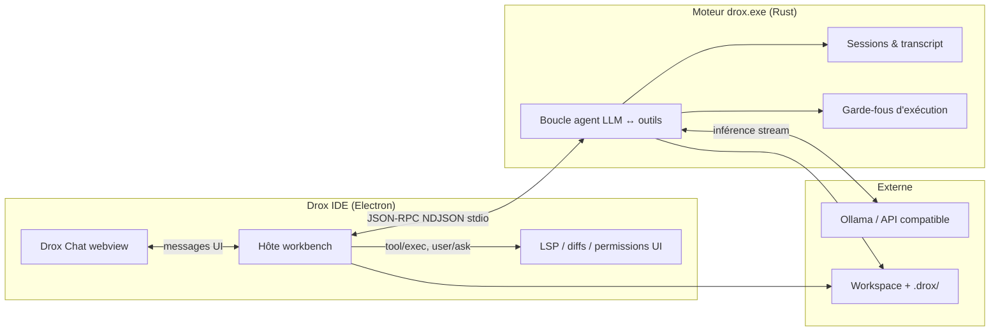
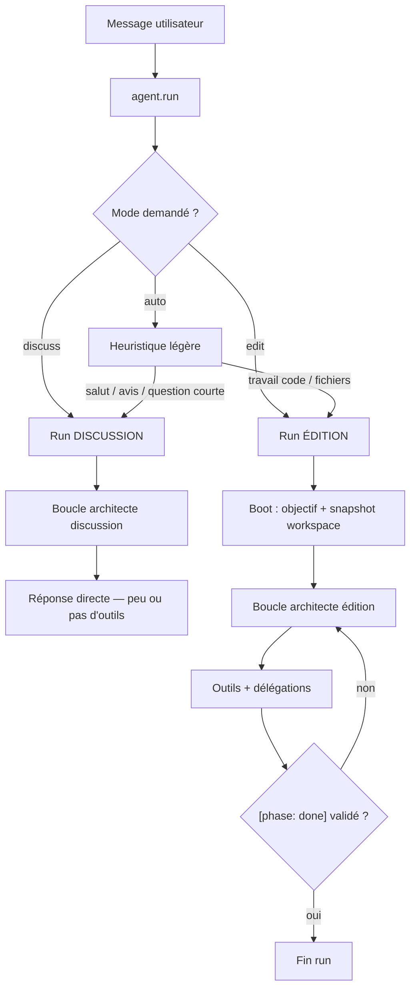
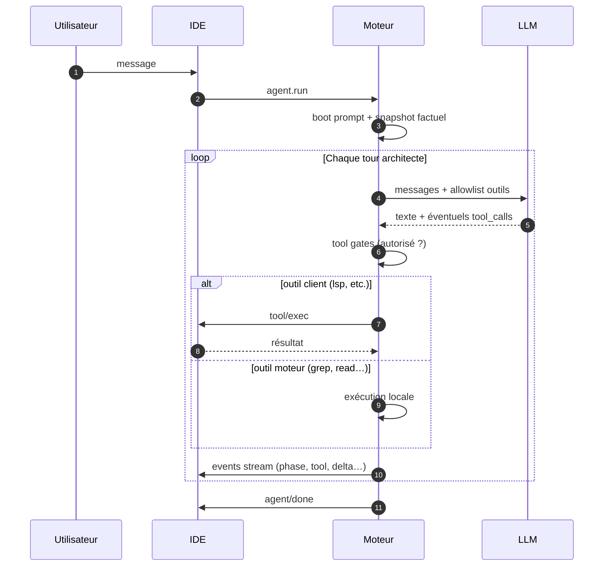
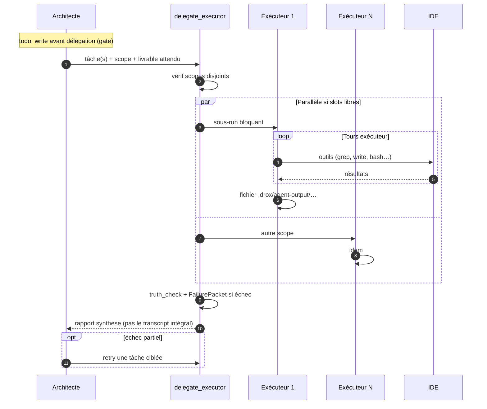
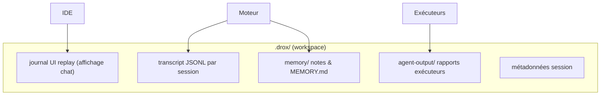
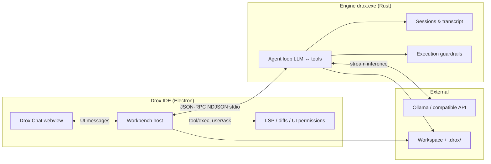
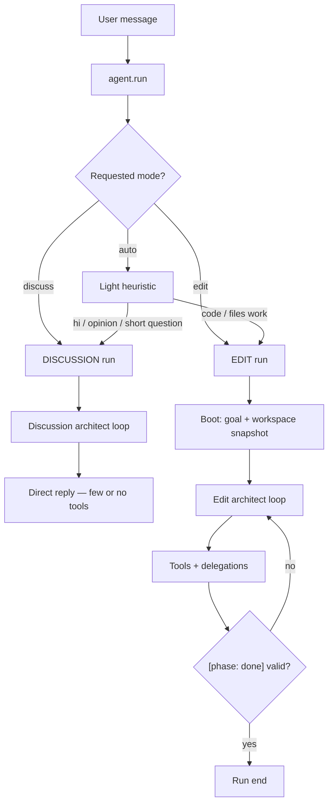
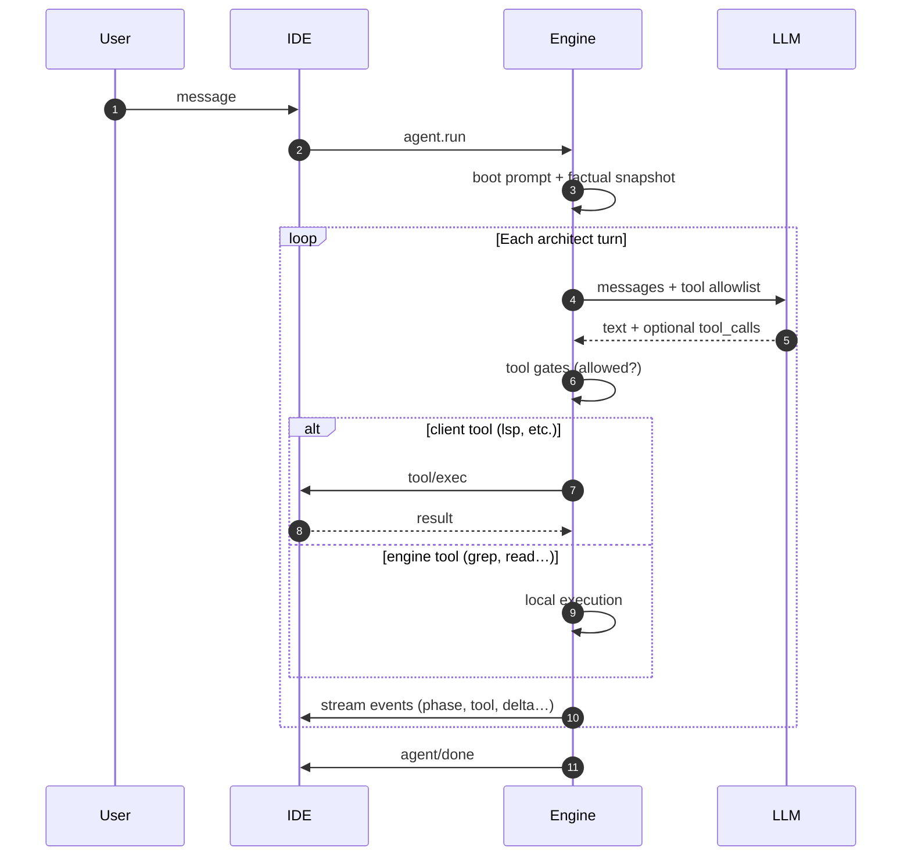
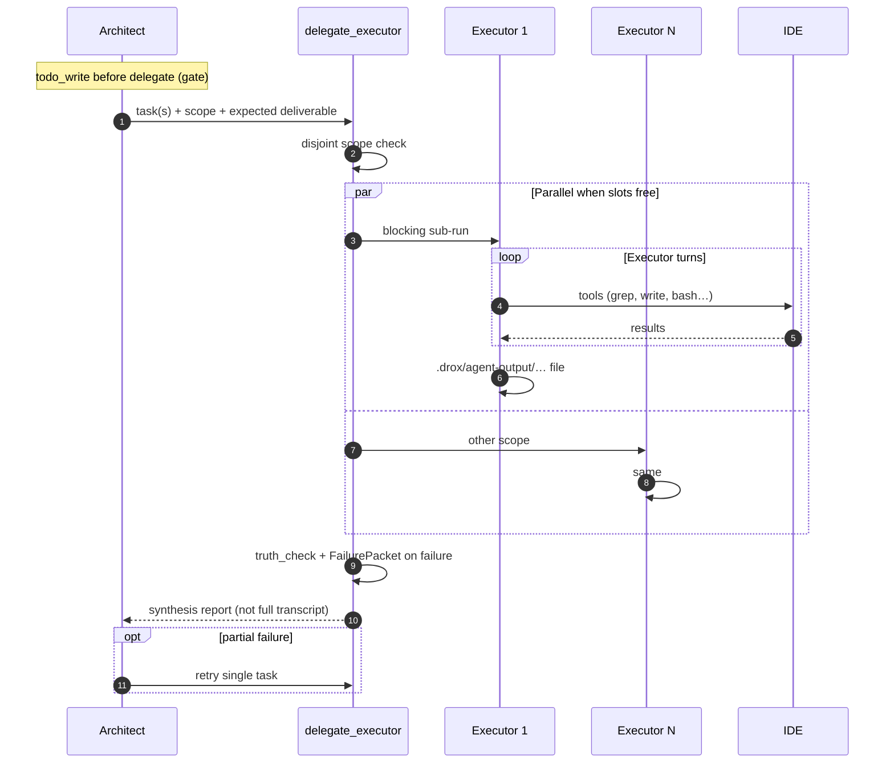

# Drox IDE — releases officielles

## ⚠️ STATUT — version 1.4.0 (juin 2026)

> **Cette release embarque la refonte moteur 1.4.0 (run rail). Le produit reste en phase de stabilisation et n’est pas utilisable en production** pour un travail agent quotidien. Usage **dogfood / développement** uniquement. Correctifs prévus en **1.4.1**.

---

**Ce dépôt** : binaires Windows, manifestes MAJ (`stable/latest.json`), notes de version.  
**Pas les sources** — moteur & branding propriétaires [KDDS](https://github.com/DroxKiwi). Socle IDE : Code OSS (MIT) — [NOTICE.md](NOTICE.md).

**Dernière version** : [1.4.0](https://github.com/DroxKiwi/Drox---IDE---OR/releases/latest) · notes [RELEASE_NOTES](stable/1.4.0/RELEASE_NOTES.md)

| | |
|---|---|
| Installer | [Releases](https://github.com/DroxKiwi/Drox---IDE---OR/releases/latest) |
| MAJ auto | `stable/latest.json` (lu au démarrage de l’IDE) |
| Ollama (recommandé) | [ollama.com](https://ollama.com/) |

---

## FR — Drox IDE en deux lignes

IDE local + agent embarqué. Pas de cloud KDDS imposé, pas de télémétrie MS dans le package. Tu branches ton LLM (Ollama ou API compatible), tu bosses dans **Drox Chat**.

---

## FR — Architecture : qui fait quoi

Le produit = **deux processus** qui ne se mélangent pas :

| Composant | Responsabilité réelle |
|-----------|----------------------|
| **Moteur `drox`** | Décide du protocole agent : tours LLM, appels d’outils, orchestration architecte/exécuteur, gates, persistance session. **Le client ne pilote pas la logique agent.** |
| **IDE** | UI chat, lance `drox --serve`, exécute les outils « client » (LSP, écriture fichier avec diff, questions bloquantes), affiche le stream (Thinking / réponse / travail). |
| **Ollama** | Inférence locale (ou autre endpoint OpenAI-compatible). Le moteur envoie prompts + tool schemas ; reçoit tokens + tool_calls. |
| **`.drox/`** | Sessions, transcripts, mémoire, sorties agent — sur **ton disque**, pas chez nous. |

Connexion IDE ↔ moteur : **une pipe stdio**, messages **NDJSON** (une requête/réponse ou un event par ligne). Pas de serveur web entre les deux.

---

## FR — Un message utilisateur → un run

Chaque envoi dans le chat déclenche un **`agent.run`** côté moteur. Avant la boucle lourde, **routage léger** :

**Discussion** — tu veux parler : réponse en prose, budget lecture limité, pas de circus `delegate_executor`.  
**Édition** — tu veux du concret : plan, todos, grep, patches, sous-agents, livrables.

> **1.3.2** : plus de chaîne de « gates » LLM avant le run (anciens probes JSON). Le routage est **direct** — moins de bruit, plus prévisible.

---

## FR — Boucle d’un run édition (architecte)

C’est le cœur du moteur. Tour par tour :

**Allowlist par tour (architecte)** — le modèle ne voit qu’un **sous-ensemble** d’outils à chaque tour (ordre de grandeur : ~6 types). Ça évite le buffet « 40 tools » qui part en vrille.

**Phases** — le modèle annonce où il en est (`reading`, `acting`, `answering`…). Seul le texte sous **`answering`** est la réponse utilisateur ; le reste alimente le panneau **Thinking** (raisonnement visible mais pas mélangé au chat).

---

## FR — Délégation : architecte ≠ exécuteur

L’architecte **ne fouille pas le repo à la place** des sous-agents. Il planifie, puis appelle **`delegate_executor`** :

| Règle interne | Pourquoi ça te concerne |
|---------------|-------------------------|
| **Scope verrouillé** | Un exécuteur = un périmètre fichiers/dossiers. Pas de « refacto tout le repo » en une délégation. |
| **Allowlist exécuteur plus stricte** (~2 outils/tour) | Moins de dérives, run plus court. |
| **Rapport synthèse** | Ton chat architecte reste lisible — pas 300 messages d’un sous-agent.recyclés. |
| **Batch parallèle** | Plusieurs tâches **si** les scopes ne se chevauchent pas et que le réglage parallèle le permet. |
| **FailurePacket** | Échec = diagnostic structuré, pas un silence ou un mensonge « c’est bon ». |

---

## FR — Garde-fous (tool gates)

Ce ne sont **pas** des « gates LLM » de discussion — ce sont des **bloqueurs d’exécution** dans la boucle :

| Gate | Effet |
|------|--------|
| `todo_write` avant `delegate_executor` | Pas de sous-agent lancé sans plan. |
| `workspace_map_read` (selon preset) | L’architecte a une carte du repo avant de déléguer à l’aveugle. |
| `[phase: done]` + todos ouverts | Refus de clôturer tant qu’il reste du travail déclaré. |
| Cap lectures / mutations | Nudge vers délégation au lieu de tout lire seul. |
| Scope disjoint | Impossible de lancer deux exécuteurs sur les mêmes fichiers en parallèle. |
| Anti-boucle | Deux tours identiques → arrêt / relance. |

Les **presets** (`relaxed` / `normal` / `strict`) modulent la sévérité — sans changer l’architecture.

---

## FR — Persistance session

- **Transcript** = vérité complète du run (export, revert, debug).  
- **UI replay** = ce que le chat réaffiche (en 1.3.2 : chargement **tail-first** + scroll pour l’historique).  
- **Compaction** = quand le contexte grossit, le moteur résume / snip pour tenir dans la fenêtre LLM.

---

## FR — Ce que le moteur n’est pas (1.3.2)

| Pas encore | Prévu |
|------------|--------|
| Index sémantique / RAG local maison | 1.3.3 |
| Graphe de contexte auto-injecté au boot | 1.3.3 |
| Fast path complétion &lt;100 ms | 1.3.3 |
| Code source ouvert | — |

On documente l’**architecture et le comportement**, pas les prompts internes ni le code Rust.

---

## EN — Drox IDE in two lines

Local IDE + embedded agent. No forced KDDS cloud, no MS telemetry in the package. Point your LLM (Ollama or compatible API) at it, work in **Drox Chat**.

---

## EN — Architecture: who does what

The product is **two processes**:

| Component | Actual responsibility |
|-----------|----------------------|
| **`drox` engine** | Owns the agent protocol: LLM turns, tool calls, architect/executor orchestration, gates, session persistence. **The client does not drive agent logic.** |
| **IDE** | Chat UI, spawns `drox --serve`, runs “client” tools (LSP, file writes with diff, blocking user questions), renders the stream (Thinking / answer / work). |
| **Ollama** | Local inference (or other OpenAI-compatible endpoint). Engine sends prompts + tool schemas; receives tokens + tool_calls. |
| **`.drox/`** | Sessions, transcripts, memory, agent outputs — on **your disk**, not ours. |

IDE ↔ engine: **stdio pipe**, **NDJSON** messages (one request/response or event per line).

---

## EN — One user message → one run

Each chat send triggers an **`agent.run`** on the engine. Light routing first:

**1.3.2**: no pre-run LLM “gate chain” (old JSON probes). Routing is **direct** — less noise, more predictable.

---

## EN — Edit run loop (architect)

**Per-turn allowlist (architect)** — the model only sees a **subset** of tools each turn (~6 types).  
**Phases** — model announces state (`reading`, `acting`, `answering`…). Only **`answering`** text is the user reply; the rest feeds **Thinking**.

---

## EN — Delegation: architect ≠ executor

---

## EN — Guardrails (tool gates)

| Gate | Effect |
|------|--------|
| `todo_write` before `delegate_executor` | No sub-agent without a plan. |
| `workspace_map_read` (preset-dependent) | Repo map before blind delegation. |
| `[phase: done]` + open todos | Refuse close while work is still declared. |
| Read / mutation caps | Nudge toward delegation instead of solo exhaustive reads. |
| Disjoint scope | No parallel executors on overlapping files. |
| Anti-loop | Identical turns → stop / retry. |

Presets (`relaxed` / `normal` / `strict`) tune severity — same architecture.

---

## EN — Session persistence

Same layout as FR diagram: `.drox/` holds JSONL transcript (source of truth), UI replay journal, `agent-output/`, memory files. Compaction kicks in when context grows.

---

## EN — What the engine is not (1.3.2)

No home-grown semantic index/RAG yet (1.3.3). No open source. We document **architecture and behavior**, not internal prompts or Rust implementation.

---

## Liens / Links

| FR | EN |
|----|-----|
| [NOTICE.md](NOTICE.md) | License & attributions |
| [stable/1.3.2/RELEASE_NOTES.md](stable/1.3.2/RELEASE_NOTES.md) | Release notes |
| [Issues](https://github.com/DroxKiwi/Drox---IDE---OR/issues) | Install & update issues |

---

*KDDS — Drox IDE. Built on Code OSS. Engine & branding proprietary.*
