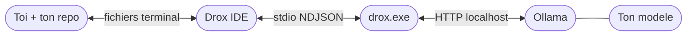
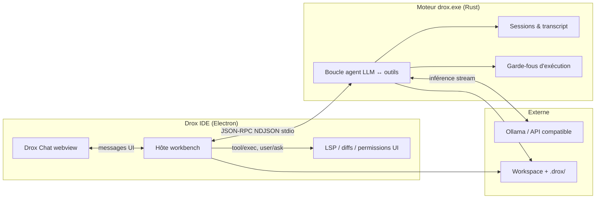
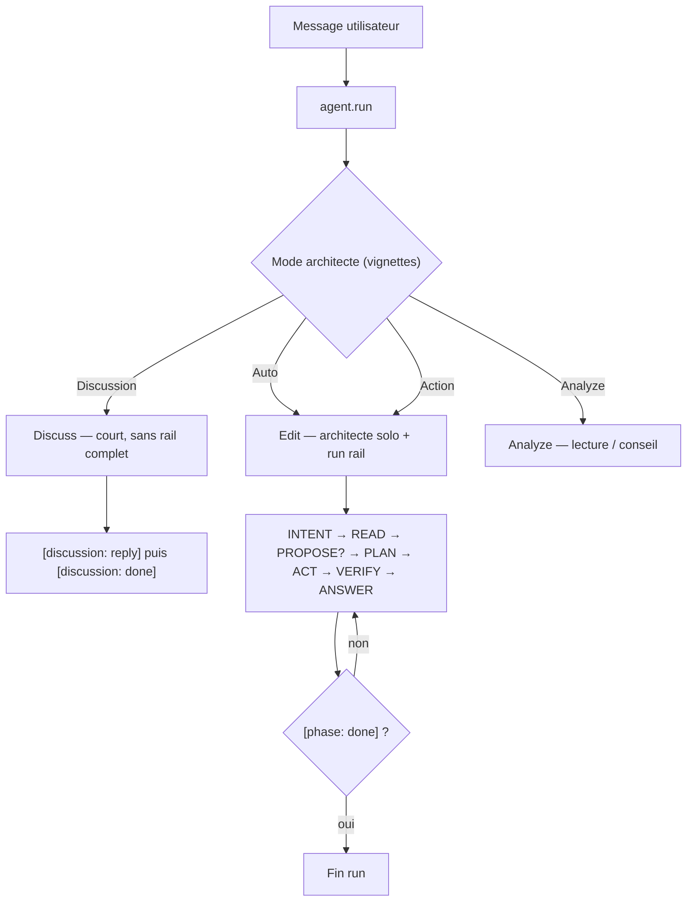
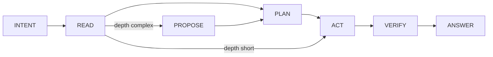
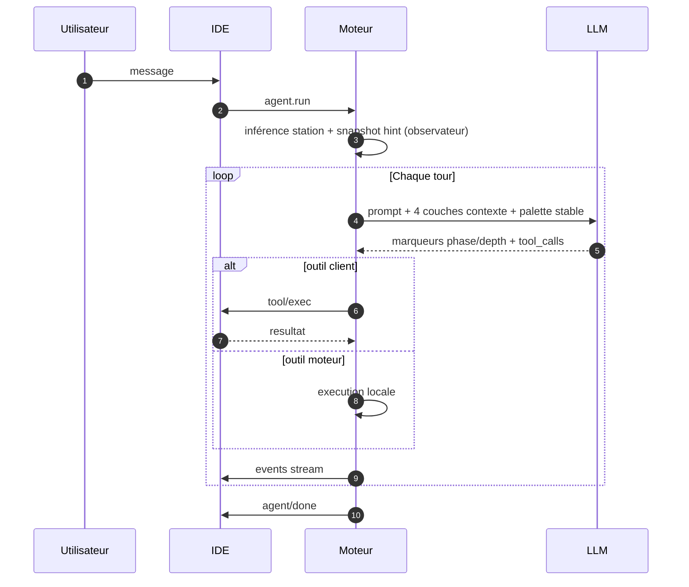
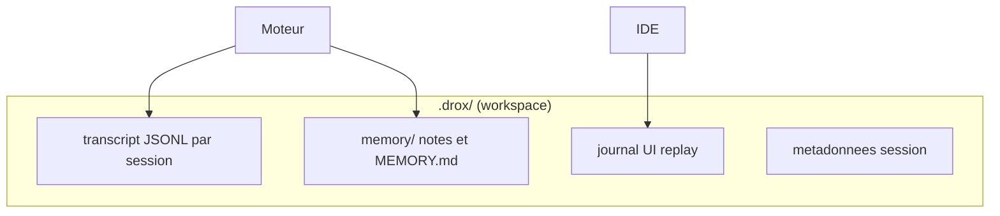
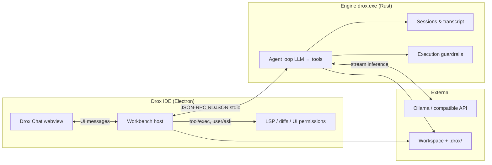
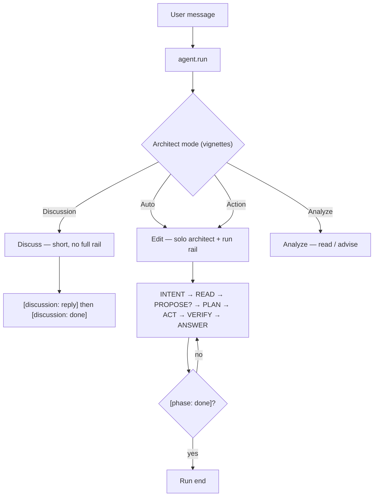
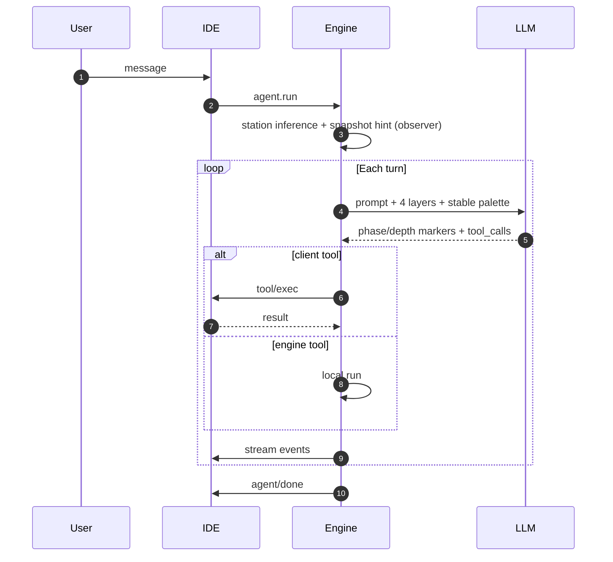

# Drox IDE — releases officielles

## ⚠️ STATUT — version 1.4.2 (juin 2026)

> **Le moteur Drox 1.4.2 est obsolète — il va complètement changer.**  
> Cette release **clôt** l’architecture rail 1.4.x (observateur + 4 couches). Phase **expérimentale agressive** : **dogfood / curiosité / early adopters** uniquement — **pas** un IDE agent de production.

**Tester** reste une **option pour les curieux** : installeur ci-dessous, Ollama, et acceptation des bugs / régressions / changements cassants sans préavis.

**En bref** : *dernière livraison de cette stack moteur — laboratoire, pas fondation long terme.*

---

**Ce dépôt** : binaires Windows, manifestes MAJ (`stable/latest.json`), notes de version.  
**Pas les sources** — moteur & branding propriétaires [KDDS](https://github.com/DroxKiwi). Socle IDE : Code OSS (MIT) — [NOTICE.md](NOTICE.md).

**Dernière version** : [1.4.2](https://github.com/DroxKiwi/Drox---IDE---OR/releases/latest) · notes [RELEASE_NOTES](stable/1.4.2/RELEASE_NOTES.md)

| | |
|---|---|
| **Version** | [**1.4.2**](https://github.com/DroxKiwi/Drox---IDE---OR/releases/latest) (juin 2026) |
| Installer | [Télécharger](https://github.com/DroxKiwi/Drox---IDE---OR/releases/latest) |
| MAJ auto | `stable/latest.json` |
| Ollama (recommandé) | [ollama.com](https://ollama.com/) |
| SmartScreen | Installeur **non signé** — « Éditeur inconnu » au premier lancement (normal) |

---

## FR — Vue globale

Tu installes **Drox IDE**, tu fais tourner **Ollama** avec un modèle (Qwen, Gemma, etc.), tu ouvres ton projet. Quand tu écris dans **Drox Chat**, l’IDE parle au moteur **`drox.exe`** en local ; le moteur appelle ton modèle et te redemande l’IDE pour ce qu’il ne peut pas faire seul (lire via LSP, appliquer un diff, te poser une question).

**La pile**

**Un message dans le chat**

| Brique | Rôle |
|--------|------|
| **Ollama** | Inférence locale — le modèle que **tu** choisis |
| **drox.exe** | Boucle agent, run rail **observateur**, permissions, session, palette outils **stable** |
| **Drox IDE** | Éditeur + chat + exécution LSP/diff dans le workspace |
| **Toi** | Repo, modèle, mode permission (`analyze` / `trust edit` / `I'm not crazy`) |

Pas de compte cloud KDDS obligatoire. Données session dans **`.drox/`** sur ton disque.

---

## FR — Drox IDE en deux lignes

IDE local + agent embarqué. Pas de télémétrie MS dans le package. Tu branches ton LLM (Ollama ou API compatible), tu bosses dans **Drox Chat**.

---

## FR — Architecture : qui fait quoi

Le produit = **deux processus** qui ne se mélangent pas :

| Composant | Responsabilité réelle |
|-----------|----------------------|
| **Moteur `drox`** | Protocole agent : tours LLM, **run rail observateur**, contexte **4 couches**, gates souples, session. **L’IDE ne pilote pas la logique agent.** |
| **IDE** | UI chat, lance `drox --serve`, exécute les outils « client » (LSP, diff, questions bloquantes), affiche le stream (Thinking / réponse / travail). |
| **Ollama** | Inférence locale (ou endpoint OpenAI-compatible). Le moteur envoie prompts + tool schemas ; reçoit tokens + tool_calls. |
| **`.drox/`** | Sessions, transcripts, mémoire — sur **ton disque**, pas chez nous. |

Connexion IDE ↔ moteur : **une pipe stdio**, messages **NDJSON** (une requête/réponse ou un event par ligne). Pas de serveur web entre les deux.

---

## FR — Un message utilisateur → un run

Chaque envoi déclenche **`agent.run`**. Le moteur route vers **discussion** ou **édition rail** selon le **mode architecte** (pas de probe LLM au boot en 1.4.2) :

**Auto** — chemin **edit** par défaut (plus d’intent probe LLM).  
**Discussion** — réflexion / question : pas de run rail complet ni mutations.  
**Action** — travail sur le code : **un seul** architecte, run rail, mutations inline.  
**Analyze** — exploration / conseil sans forcing mutation.

Les vignettes chat (`Auto` / `Discussion` / `Action`) correspondent à `drox.architect.interactionMode`.

---

## FR — Run rail observateur (édition — 1.4.2)

L’édition suit **7 stations** inférées pour l’UI et le snapshot — **sans** filtre ACL outils par station. La palette (`file_read`, `file_edit`, `grep`, `bash`, …) reste **stable** tout le run.

**INTENT** — boot + plan interne optionnel (`internal_plan_write`).  
**PROPOSE** (si `[depth: complex]`) — texte ; pause possible avant PLAN.  
**Chemin court** — `[depth: short]` saute PROPOSE et PLAN → ACT.

**Marqueurs edit** — `[depth: short|complex]`, `[phase: answering]`, `[phase: done]`. Seul le texte sous **`answering`** est la réponse chat ; le reste va dans **Thinking**.

**Marqueurs discuss** — `[discussion: reply]` puis `[discussion: done]`.

**Contexte 4 couches** — (1) cadre boot + hint rail, (2) outils wire + protocole compact, (3) snapshot run + plan interne, (4) transcript + compaction.

---

## FR — Garde-fous (1.4.2 — souples)

Le rail est **observateur** : inférence et snapshot, **pas** de forcing mutation ni de blocage outil par station.

| Mécanisme | Effet |
|-----------|--------|
| Permissions / hooks | Allow / ask / deny sur chemins et bash |
| `internal_plan_write` | Plan moteur optionnel — plus de gate todo sur `done` |
| `[phase: done]` | Fin de run explicite |
| Snapshot rail | Hint informatif pour le modèle — pas prescriptif |
| Profil produit unique | Tuning moteur fixe côté KDDS |

**Retiré en 1.4.2** : tool folders, ACL par station, `stall_read` / `stall_act`, intent probe, `todo_write`, gates mutation sur `done`.

---

## FR — Persistance session

- **Transcript** = vérité du run (debug, export).  
- **UI replay** = ce que le chat réaffiche à la réouverture.  
- **Compaction** = résumé / snip quand le contexte dépasse la fenêtre LLM.

---

## FR — Ce que le produit n’est pas (1.4.2)

| Pas | Détail |
|-----|--------|
| **Moteur stable long terme** | **Obsolète** — refonte complète annoncée |
| IDE agent fiable au quotidien (prod) | Expérimental agressif — curieux / dogfood seulement |
| Produit « fini » | Point d’arrêt 1.4.x, pas fondation |
| Index sémantique / graphe | Piste post-refonte moteur |
| Signature Authenticode | Prévu 1.4.3+ — SmartScreen « Éditeur inconnu » |
| Code source moteur ouvert | — |

On documente l’**architecture et le comportement** côté utilisateur, pas les prompts internes ni le code Rust.

---

## EN — Status (1.4.2)

> **Drox engine 1.4.2 is obsolete — it will change completely.**  
> This release **closes** the 1.4.x rail architecture (observer + 4 layers). **Aggressive experimental** phase — **dogfood / curiosity / early adopters** only, **not** a production daily driver.

**Trying it** is **optional for the curious**: installer below, Ollama, and acceptance of bugs / regressions / breaking changes without notice.

**In short**: *last ship of this engine stack — lab, not a long-term foundation.*

---

## EN — Overview

Install **Drox IDE**, run **Ollama** with a model (Qwen, Gemma, etc.), open your project. When you type in **Drox Chat**, the IDE talks to local **`drox.exe`**; the engine calls your model and asks the IDE back for what it cannot do alone (LSP, diffs, blocking questions).

**The stack**

**One chat message**

| Piece | Role |
|-------|------|
| **Ollama** | Local inference — the model **you** pick |
| **drox.exe** | Agent loop, **observer** run rail, permissions, session, **stable** tool palette |
| **Drox IDE** | Editor + chat + LSP/diff in the workspace |
| **You** | Repo, model, permission mode (`analyze` / `trust edit` / `I'm not crazy`) |

No mandatory KDDS cloud account. Session data in **`.drox/`** on your disk.

---

## EN — Drox IDE in two lines

Local IDE + embedded agent. No MS telemetry in the package. Point your LLM (Ollama or compatible API) at it, work in **Drox Chat**.

---

## EN — Architecture: who does what

The product is **two processes**:

| Component | Actual responsibility |
|-----------|----------------------|
| **`drox` engine** | Agent protocol: LLM turns, **observer run rail**, **4-layer** context, soft gates, session. **The IDE does not drive agent logic.** |
| **IDE** | Chat UI, spawns `drox --serve`, runs “client” tools (LSP, diff, blocking questions), renders the stream (Thinking / answer / work). |
| **Ollama** | Local inference (or OpenAI-compatible endpoint). Engine sends prompts + tool schemas; receives tokens + tool_calls. |
| **`.drox/`** | Sessions, transcripts, memory — on **your disk**, not ours. |

IDE ↔ engine: **stdio pipe**, **NDJSON** messages (one request/response or event per line).

---

## EN — One user message → one run

Each send triggers **`agent.run`**. The engine routes to **discussion** or **rail edit** via **architect mode** (no LLM intent probe at boot in 1.4.2):

**Auto** — **edit** path by default (no LLM intent probe).  
**Discussion** — chat / question: no full run rail or mutations.  
**Action** — code work: single architect, run rail, inline mutations.  
**Analyze** — exploration / advice without forced mutation.

Chat vignettes (`Auto` / `Discussion` / `Action`) map to `drox.architect.interactionMode`.

---

## EN — Observer run rail (edit — 1.4.2)

Edit runs follow **7 inferred stations** for UI and snapshot — **no** per-station tool ACL. The palette (`file_read`, `file_edit`, `grep`, `bash`, …) stays **stable** for the whole run.

**INTENT** — boot + optional internal plan (`internal_plan_write`).  
**PROPOSE** (when `[depth: complex]`) — text; optional pause before PLAN.  
**Short path** — `[depth: short]` skips PROPOSE and PLAN → ACT.

**Edit markers** — `[depth: short|complex]`, `[phase: answering]`, `[phase: done]`. Only **`answering`** text is the chat reply; the rest goes to **Thinking**.

**Discuss markers** — `[discussion: reply]` then `[discussion: done]`.

**4 context layers** — (1) boot frame + rail hint, (2) wire tools + compact protocol, (3) run snapshot + internal plan, (4) transcript + compaction.

---

## EN — Guardrails (1.4.2 — soft)

The rail is **observer**: inference and snapshot, **no** forced mutation or per-station tool blocking.

| Mechanism | Effect |
|-----------|--------|
| Permissions / hooks | Allow / ask / deny on paths and bash |
| `internal_plan_write` | Optional engine plan — no todo gate on `done` |
| `[phase: done]` | Explicit run end |
| Rail snapshot | Informative hint for the model — not prescriptive |
| Single product profile | Engine tuning fixed by KDDS |

**Removed in 1.4.2**: tool folders, per-station ACL, `stall_read` / `stall_act`, intent probe, `todo_write`, mutation gates on `done`.

---

## EN — Session persistence

Same layout as FR: `.drox/` holds JSONL transcript (source of truth), UI replay journal, memory files. Compaction when context exceeds the LLM window.

---

## EN — What the product is not (1.4.2)

| Not | Detail |
|-----|--------|
| **Long-term stable engine** | **Obsolete** — full rewrite announced |
| Reliable day-to-day agent IDE (production) | Aggressive experimental — curious / dogfood only |
| « Finished » product | 1.4.x checkpoint, not a foundation |
| Semantic index / graph | Post engine rewrite |
| Authenticode signing | Planned 1.4.3+ — SmartScreen « Unknown publisher » |
| Open engine source | — |

We document **user-facing architecture and behavior**, not internal prompts or Rust code.

---

## Liens / Links

| FR | EN |
|----|-----|
| [NOTICE.md](NOTICE.md) | License & attributions |
| [stable/1.4.2/RELEASE_NOTES.md](stable/1.4.2/RELEASE_NOTES.md) | Release notes |
| [Issues](https://github.com/DroxKiwi/Drox---IDE---OR/issues) | Install & update issues |

---

*KDDS — Drox IDE. Built on Code OSS. Engine & branding proprietary.*
