# Drox IDE — releases officielles

## ⚠️ STATUT — version 1.4.1 (juin 2026)

> **La 1.4.1 est nettement plus stable que la 1.4.0** (rail, discuss/edit, plan interne, tool folders, garde-fous VERIFY).  
> **Elle reste toutefois expérimentale** : usage **dogfood / développement / early adopters** uniquement — **pas** un IDE agent de production pour un travail quotidien critique.  
> Attendez-vous à des régressions, des lenteurs modèle et un polish UI incomplet (→ **1.4.2**).

**En bref** : *plus fiable qu’avant, pas encore « produit fini ».*

---

**Ce dépôt** : binaires Windows, manifestes MAJ (`stable/latest.json`), notes de version.  
**Pas les sources** — moteur & branding propriétaires [KDDS](https://github.com/DroxKiwi). Socle IDE : Code OSS (MIT) — [NOTICE.md](NOTICE.md).

| | |
|---|---|
| **Dernière release publiée** | [1.4.0](https://github.com/DroxKiwi/Drox---IDE---OR/releases/tag/v1.4.0) |
| **Prochaine** | **1.4.1** — notes prêtes · [RELEASE_NOTES](stable/1.4.1/RELEASE_NOTES.md) · installeur via `npm run drox:ship` puis GitHub Release |
| Installer | [Releases](https://github.com/DroxKiwi/Drox---IDE---OR/releases) |
| MAJ auto | `stable/latest.json` (basculé sur 1.4.1 après upload de l’exe) |
| Ollama (recommandé) | [ollama.com](https://ollama.com/) |

---

## FR — Vue globale

Tu installes **Drox IDE**, tu fais tourner **Ollama** avec un modèle (Qwen, Gemma, etc.), tu ouvres ton projet. Quand tu écris dans **Drox Chat**, l’IDE parle au moteur **`drox.exe`** en local ; le moteur appelle ton modèle et te redemande l’IDE pour ce qu’il ne peut pas faire seul (lire via LSP, appliquer un diff, te poser une question).

**La pile**

**Un message dans le chat**

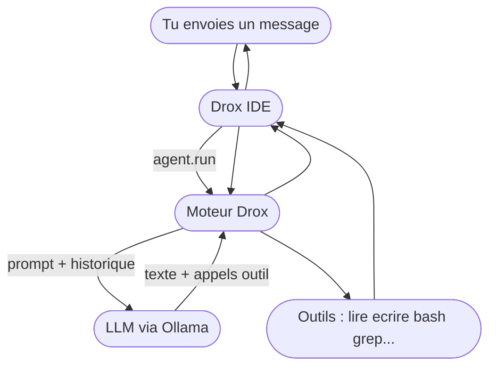

| Brique | Rôle |
|--------|------|
| **Ollama** | Inférence locale — le modèle que **tu** choisis |
| **drox.exe** | Boucle agent, run rail, permissions, session |
| **Drox IDE** | Éditeur + chat + exécution LSP/diff dans le workspace |
| **Toi** | Repo, modèle, mode permission (`analyze` / `trust edit` / `I'm not crazy`) |

Pas de compte cloud KDDS obligatoire. Données session dans **`.drox/`** sur ton disque.

---

## FR — Drox IDE en deux lignes

IDE local + agent embarqué. Pas de télémétrie MS dans le package. Tu branches ton LLM (Ollama ou API compatible), tu bosses dans **Drox Chat**.

---

## FR — Architecture : qui fait quoi

Le produit = **deux processus** qui ne se mélangent pas :

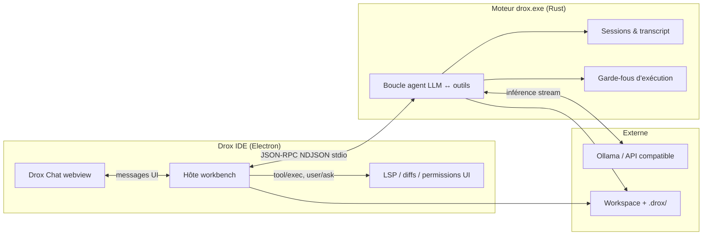

| Composant | Responsabilité réelle |
|-----------|----------------------|
| **Moteur `drox`** | Protocole agent : tours LLM, **run rail** (stations edit), **tool folders**, gates, session. **L’IDE ne pilote pas la logique agent.** |
| **IDE** | UI chat, lance `drox --serve`, exécute les outils « client » (LSP, diff, questions bloquantes), affiche le stream (Thinking / réponse / travail). |
| **Ollama** | Inférence locale (ou endpoint OpenAI-compatible). Le moteur envoie prompts + tool schemas ; reçoit tokens + tool_calls. |
| **`.drox/`** | Sessions, transcripts, mémoire — sur **ton disque**, pas chez nous. |

Connexion IDE ↔ moteur : **une pipe stdio**, messages **NDJSON** (une requête/réponse ou un event par ligne). Pas de serveur web entre les deux.

---

## FR — Un message utilisateur → un run

Chaque envoi déclenche **`agent.run`**. Le moteur route ensuite vers **discussion** ou **édition rail** :

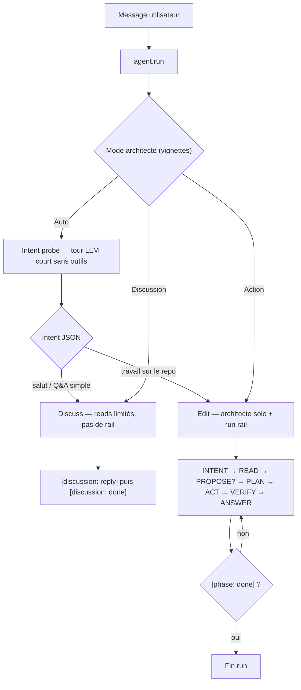

**Auto** — le moteur lance un **intent probe** (petit tour LLM au boot) pour choisir discuss vs edit.  
**Discussion** — réflexion / question : outils lecture seule possibles, **pas** de run rail ni `todo_write` / mutations.  
**Action** — travail sur le code : **un seul** architecte, **run rail** complet, mutations inline (**plus** de sous-agent `delegate_executor`).

Les vignettes chat (`Auto` / `Discussion` / `Action`) correspondent à `drox.architect.interactionMode`.

---

## FR — Run rail (édition)

Depuis la **1.4.0** (renforcé en **1.4.1**), l’édition suit **7 stations** linéaires. Le moteur filtre les outils visibles **par station** avant chaque tour LLM. Certaines capacités sont regroupées en **dossiers outils** (`read_workspace`, `edit_file`, `verify_project`…) : un appel `describe` débloque les outils « wire » du dossier.

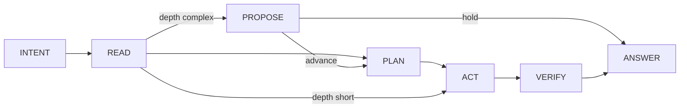

**INTENT** (boot) — `internal_plan_write` obligatoire avant exploration ; dossier `read_workspace` (`describe`).  
**PROPOSE** (si `[depth: complex]`) — texte seul ; `[gate: hold]` **attend** la réponse utilisateur avant PLAN.  
**Chemin court** — après READ, `[depth: short]` saute PROPOSE et PLAN → ACT direct.

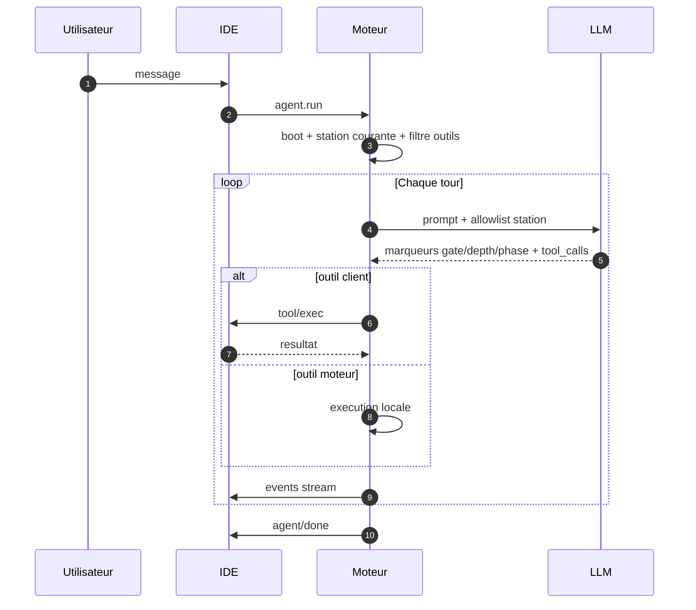

**Marqueurs edit** — `[gate: hold|advance]`, `[depth: short|complex]`, `[phase: answering]`, `[phase: done]`. Seul le texte sous **`answering`** est la réponse chat ; le reste va dans **Thinking**.

**Marqueurs discuss** — `[discussion: reply]` puis `[discussion: done]` (pas de `[phase: …]` rail).

**Outils par station (résumé)** — INTENT : plan interne + describe reads ; READ : lecture ; PLAN : `todo_write` + reads ; ACT : mutations (`edit_file` describe → `file_edit`…) ; VERIFY : `bash` / `lsp` / `verify_project`, pas de nouvelle mutation fichier.

---

## FR — Garde-fous

Bloqueurs dans la boucle — pas un second « cerveau » parallèle :

| Garde-fou | Effet |
|-----------|--------|
| Filtre par station + **tool folders** | Pas de `file_edit` en READ ; `describe` avant outils pliés |
| Plan interne L2 | `internal_plan_write` requis en INTENT avant reads |
| `[phase: done]` + todos ouverts | Refus de clôturer si travail déclaré en cours |
| `answering` avant `done` | Réponse utilisateur exigée avant fin (edit) |
| Stall READ / ACT | Nudge si exploration ou mutations bloquées trop longtemps |
| PROPOSE hold | `[gate: hold]` en depth complex — pause jusqu’au message utilisateur |
| Permissions / hooks | Allow / ask / deny sur chemins et bash |

Les **garde-fous** (gates, filtre par station, permissions) sont réglés par un **profil produit unique** côté moteur — plus de presets utilisateur `relaxed` / `normal` / `strict` dans Settings.

---

## FR — Persistance session

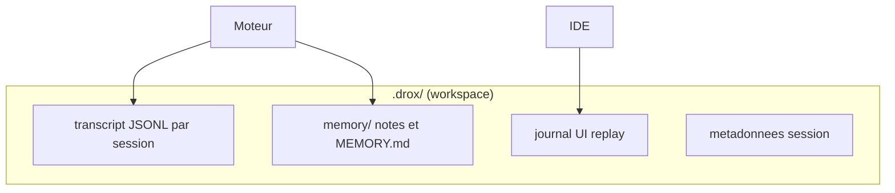

- **Transcript** = vérité du run (debug, export).  
- **UI replay** = ce que le chat réaffiche à la réouverture.  
- **Compaction** = résumé / snip quand le contexte dépasse la fenêtre LLM.

---

## FR — Ce que le produit n’est pas encore (1.4.x)

| Pas encore | Piste |
|------------|--------|
| Produit **stable et fini** | **1.4.1** = nettement plus stable, **toujours expérimental** |
| IDE agent fiable au quotidien (prod) | Dogfood / early adopters seulement |
| UI chat polie (conducteur, thinking) | **1.4.2** |
| Index sémantique / graphe / fast path | **1.4.3** |
| Profils sampling LLM par phase (dev) | **1.4.4** (spec) |
| Code source moteur ouvert | — |

On documente l’**architecture et le comportement** côté utilisateur, pas les prompts internes ni le code Rust.

---

## EN — Status (1.4.1)

> **1.4.1 is significantly more stable than 1.4.0** (rail, discuss/edit, internal plan, tool folders, VERIFY guardrails).  
> **It is still experimental** — **dogfood / development / early adopters** only, **not** a production-grade daily driver. Expect regressions, model latency, and incomplete UI polish (→ **1.4.2**).

**In short**: *more reliable than before, not a finished product yet.*

---

## EN — Overview

Install **Drox IDE**, run **Ollama** with a model (Qwen, Gemma, etc.), open your project. When you type in **Drox Chat**, the IDE talks to local **`drox.exe`**; the engine calls your model and asks the IDE back for what it cannot do alone (LSP, diffs, blocking questions).

**The stack**

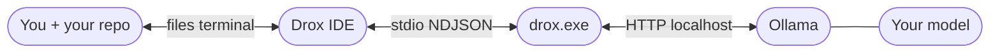

**One chat message**

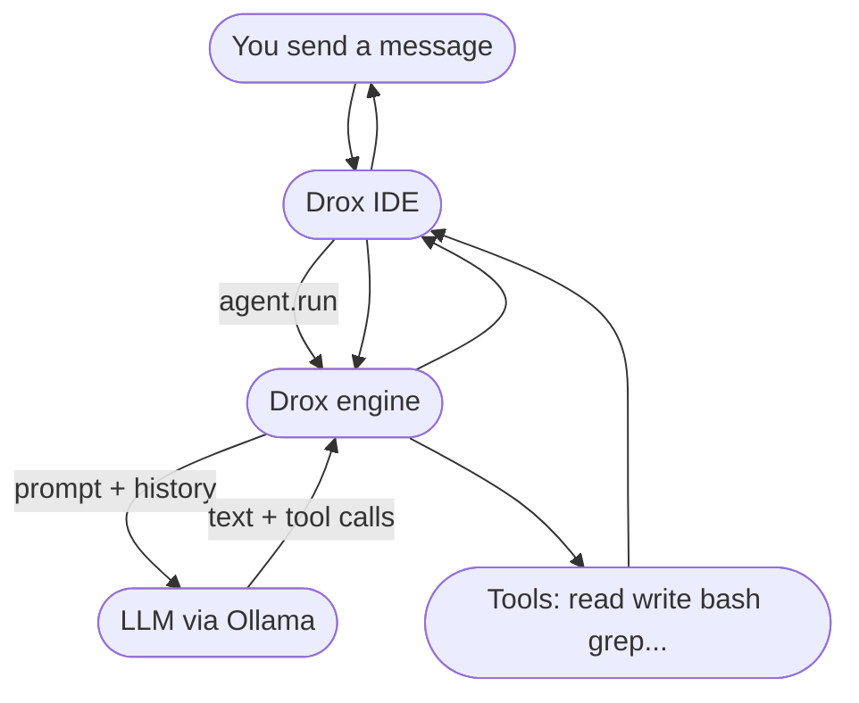

| Piece | Role |
|-------|------|
| **Ollama** | Local inference — the model **you** pick |
| **drox.exe** | Agent loop, run rail, permissions, session |
| **Drox IDE** | Editor + chat + LSP/diff in the workspace |
| **You** | Repo, model, permission mode (`analyze` / `trust edit` / `I'm not crazy`) |

No mandatory KDDS cloud account. Session data in **`.drox/`** on your disk.

---

## EN — Drox IDE in two lines

Local IDE + embedded agent. No MS telemetry in the package. Point your LLM (Ollama or compatible API) at it, work in **Drox Chat**.

---

## EN — Architecture: who does what

The product is **two processes**:

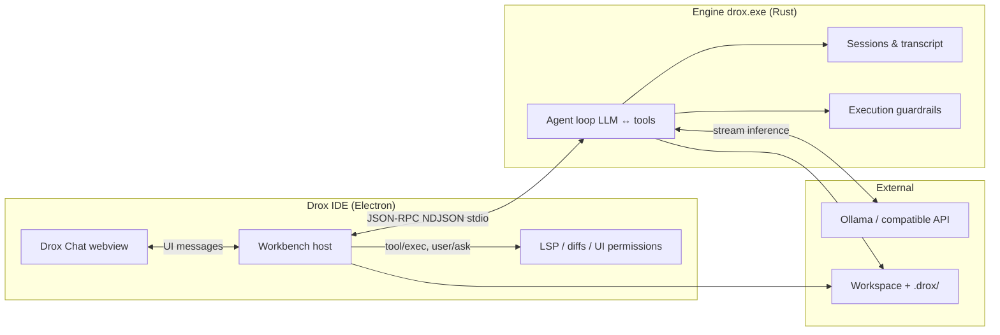

| Component | Actual responsibility |
|-----------|----------------------|
| **`drox` engine** | Agent protocol: LLM turns, **run rail** (edit stations), **tool folders**, gates, session. **The IDE does not drive agent logic.** |
| **IDE** | Chat UI, spawns `drox --serve`, runs “client” tools (LSP, diff, blocking questions), renders the stream (Thinking / answer / work). |
| **Ollama** | Local inference (or OpenAI-compatible endpoint). Engine sends prompts + tool schemas; receives tokens + tool_calls. |
| **`.drox/`** | Sessions, transcripts, memory — on **your disk**, not ours. |

IDE ↔ engine: **stdio pipe**, **NDJSON** messages (one request/response or event per line).

---

## EN — One user message → one run

Each send triggers **`agent.run`**. The engine then routes to **discussion** or **rail edit**:

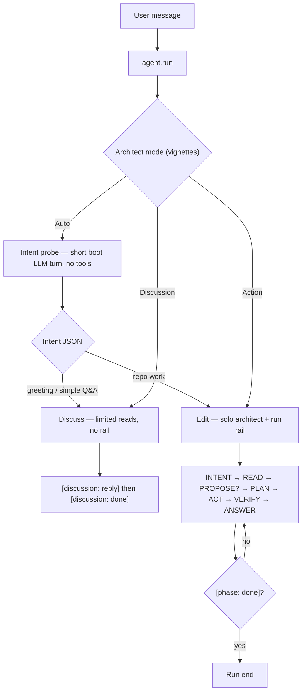

**Auto** — boot **intent probe** (small LLM turn) picks discuss vs edit.  
**Discussion** — chat / question: read-only tools allowed, **no** run rail or `todo_write` / mutations.  
**Action** — code work: **single** architect, full **run rail**, inline mutations (**no** `delegate_executor` sub-agent).

Chat vignettes (`Auto` / `Discussion` / `Action`) map to `drox.architect.interactionMode`.

---

## EN — Run rail (edit)

Since **1.4.0** (hardened in **1.4.1**), edit runs follow **7 linear stations**. The engine filters visible tools **per station** before each LLM turn. Some capabilities are grouped in **tool folders** (`read_workspace`, `edit_file`, `verify_project`…): a `describe` call unlocks the folder’s wire tools.

**INTENT** (boot) — mandatory `internal_plan_write` before exploration; `read_workspace` folder (`describe`).  
**PROPOSE** (when `[depth: complex]`) — text only; `[gate: hold]` **waits** for the user before PLAN.  
**Short path** — after READ, `[depth: short]` skips PROPOSE and PLAN → straight to ACT.

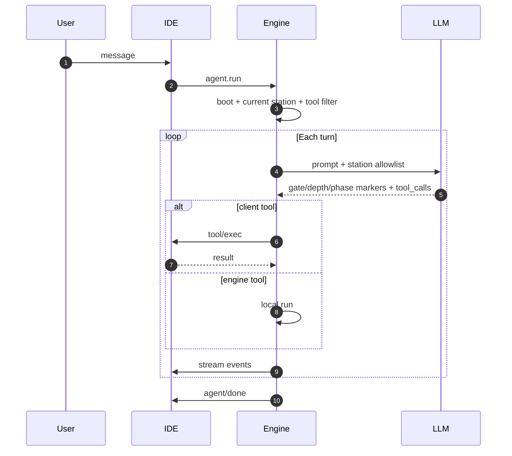

**Edit markers** — `[gate: hold|advance]`, `[depth: short|complex]`, `[phase: answering]`, `[phase: done]`. Only **`answering`** text is the chat reply; the rest goes to **Thinking**.

**Discuss markers** — `[discussion: reply]` then `[discussion: done]` (no rail `[phase: …]`).

**Tools per station (summary)** — INTENT: internal plan + describe reads ; READ: exploration ; PLAN: `todo_write` + reads ; ACT: mutations (`edit_file` describe → `file_edit`…) ; VERIFY: `bash` / `lsp` / `verify_project`, no new file mutations.

---

## EN — Guardrails

Blockers in the loop — not a parallel second “brain”:

| Guardrail | Effect |
|-----------|--------|
| Per-station filter + **tool folders** | No `file_edit` in READ; `describe` before folded tools |
| Internal plan L2 | `internal_plan_write` required in INTENT before reads |
| `[phase: done]` + open todos | Refuse close while declared work remains |
| `answering` before `done` | User reply required before end (edit) |
| READ / ACT stall | Nudge when exploration or mutations stay blocked too long |
| PROPOSE hold | `[gate: hold]` on complex depth — pause until user message |
| Permissions / hooks | Allow / ask / deny on paths and bash |

Presets (`relaxed` / `normal` / `strict`) were removed — a single **product profile** applies engine guardrails.

---

## EN — Session persistence

Same layout as FR: `.drox/` holds JSONL transcript (source of truth), UI replay journal, memory files. Compaction when context exceeds the LLM window.

---

## EN — What the product is not yet (1.4.x)

| Not yet | Track |
|---------|--------|
| **Stable, finished product** | **1.4.1** = much more stable, **still experimental** |
| Reliable day-to-day agent IDE (production) | Dogfood / early adopters only |
| Polished chat UI (conductor, thinking) | **1.4.2** |
| Semantic index / graph / fast path | **1.4.3** |
| Per-phase LLM sampling profiles (dev) | **1.4.4** (spec) |
| Open engine source | — |

We document **user-facing architecture and behavior**, not internal prompts or Rust code.

---

## Liens / Links

| FR | EN |
|----|-----|
| [NOTICE.md](NOTICE.md) | License & attributions |
| [stable/1.4.1/RELEASE_NOTES.md](stable/1.4.1/RELEASE_NOTES.md) | Release notes **1.4.1** (prochaine) |
| [stable/1.4.0/RELEASE_NOTES.md](stable/1.4.0/RELEASE_NOTES.md) | Release notes 1.4.0 |
| [Issues](https://github.com/DroxKiwi/Drox---IDE---OR/issues) | Install & update issues |

---

*KDDS — Drox IDE. Built on Code OSS. Engine & branding proprietary.*
