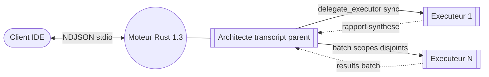
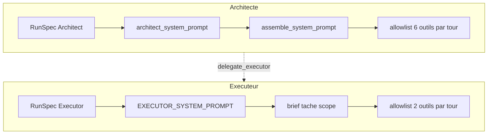
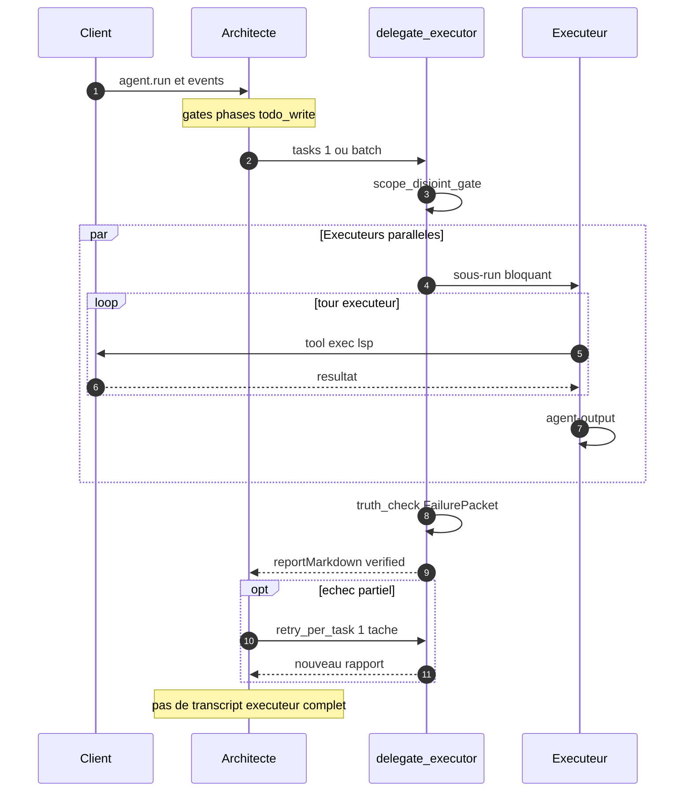

Doc moteur brute — conventions : [RULES.md §5](RULES.md#5-readmemd-racine--doc-moteur)

## Sommaire

[Schéma 1.3 — prompts & outils](#schema-13)

**FR**

[Moteur Drox](#fr) · [Invariants](#fr-invariants) · [Chronologie](#fr-chronologie)

[2025-12](#fr-2025-12) · [2026-02](#fr-2026-02) · [2026-02-fin](#fr-2026-02-fin) · [2026-03](#fr-2026-03) · [2026-04](#fr-2026-04) · [2026-05 v1_2](#fr-2026-05-v12) · [2026-05 v1_3](#fr-2026-05-v13)

**EN**

[Drox Engine](#en) · [Invariants](#en-invariants) · [Timeline](#en-timeline)

[2025-12](#en-2025-12) · [2026-02](#en-2026-02) · [2026-02-end](#en-2026-02-end) · [2026-03](#en-2026-03) · [2026-04](#en-2026-04) · [2026-05 v1_2](#en-2026-05-v12) · [2026-05 v1_3](#en-2026-05-v13)

___

## Schéma — 1.3 (prompts & outils)

Run `agent.run` · orchestration architecte / exécuteur (`DROX_ORCHESTRATION=v1_2`) · lot **1.3** : batch parallèle, `FailurePacket`, re-délégation ciblée · sous-agent legacy `task` désactivé.

**Vue d’ensemble**

**Prompts & registres par rôle**

**Cycle d’une délégation**

| Identifiant | Fonction |
|-------------|----------|
| `RunSpec` | Allowlist + limites par rôle ; seuls ces outils partent au LLM |
| `assemble_system_prompt` | Contexte workspace sur l’Architecte uniquement |
| `delegate_executor` | Sync ; batch `tasks[]` ; architecte en attente |
| `parallel_batch` | Plusieurs exécuteurs si scopes disjoints et slots libres |
| `failure_absorption` | `truth_check` + `FailurePacket` dans le rapport |
| `retry_per_task` | Re-délégation d’une tâche seule après échec partiel |
| `architect_gates` | Anti-rattrapage, cap relances, todo ouvert avant `done` |

___

# Moteur Drox

Binaire Rust (`drox-engine/drox/`) qui fait tourner une boucle LLM + outils en local. Le client (IDE) lance `drox --serve`, lit du NDJSON sur stdio, et exécute ce qui ne peut pas tourner dans le moteur (LSP, diff, questions UI). Inférence via Ollama ou API compatible. Produit KDDS — pas de cloud propriétaire imposé.

___

## Invariants

`moteur_seul` — phases, gates, orchestration et registre d’outils vivent dans Rust ; le client ne décide pas du protocole agent.
`done_obligatoire` — fin de run uniquement sur marqueur `[phase: done]` ; pas de « plus d’outil donc on arrête ».
`answering_avant_done` — `done` refusé ou nudgé si `answering` n’a pas été vu dans le run.
`phases_marqueurs` — le modèle annonce `analyzing`, `reading`, `acting`, `testing`, `answering`, etc. ; seul le texte sous `answering` est la réponse utilisateur.
`architecte_pas_executant` — rôle architecte : plan + délégation ; pas de glob/grep/file_read pour rattraper un exécuteur (gates).
`brief_delegate` — chaque `delegate_executor` embarque instructions, livrable, `scope` ; pas un titre vide.
`rapport_synthese` — l’architecte reçoit un rapport exécuteur résumé, pas le transcript intégral du sous-run.
`roles_pas_tiers` — vignettes Low/Medium abandonnées ; remplacées par modèles et registres séparés architecte / exécuteur.
`batch_parallel_with` — plusieurs tâches exécuteur dans un seul appel ; scopes disjoints ; plafond `maxParallelExecutors`.

___

## Chronologie

### 2025-12 — amorçage

`drox_cli` — binaire `drox`.
`serve_stdio` — mode `drox --serve`, JSON-RPC NDJSON.
`rpc_base` — `initialize`, `agent.run`, `agent.cancel`, `session.list`, `session.read`, `session.compact`, `shutdown`.
`rpc_client` — `tool/exec`, `user/ask` (serveur → client).
`agent_loop` — tours LLM, `tool_calls`, events `agent/event`, transcript JSONL.
`drox_llm` — client Ollama, stream, retry, tool calls, reprise sur `MaxTokens`.
`tools_fichiers` — `file_read`, `file_write`, `file_edit`, `grep`, `glob`, `bash`, `web_fetch`.
`plan_mode` — `plan_mode`, `exit_plan_mode`, `ask_user_question`.
`drox_permissions` — allow / ask / deny, modes permission.
`drox_session` — sessions, transcript, `MEMORY.md`, `DROX.md`.
`drox_context` — comptage tokens, snip `tool_result`.
`session_compact_rpc` — compaction manuelle `session.compact` / `summarize_run`.
`mcp_stubs` — `drox-mcp`, outils `mcp__*`.

___

### 2026-02

`multimodal` — images utilisateur → `Content::Image`, champ Ollama `images`.
`web_search` — recherche DuckDuckGo HTML, read-only.
`lsp_remote` — tool `lsp` ; exécution IDE.
`ollama_defaults` — `num_ctx`, `num_predict`, sampling, `keep_alive` top-level.

___

### 2026-02-fin

`todo_write` — liste `{ id, content, status }`.
`phase_protocol` — `[phase: …]`, `PhaseEnter`, inférence, alias.
`nudge_tour_vide` — relance si tour sans outil ni `done`.
`gate_todo_ouverte` — `done` bloqué si pending/in_progress.
`glob_dirs` — `glob` renvoie fichiers et répertoires.
`loop_detector` — deux tours identiques → `LoopDetected`.
`todo_recreation_block` — second plan interdit après plan 100 % completed.
`memory_sessions` — `.drox/memory/sessions/*.md`, `memory_read`, `memory_list`, `session_note`, `MemoryPersisted`.
`compaction_live_v1` — microcompact, tail bornée, `compact_until_budget`, events snip/compact.
`paste_inject` — bloc `[Smart paste]` dans le prompt (côté client).
`user_ask` — `ask_user_question` multi + RPC `user/ask`.
`msg_queue` — file messages pendant run (client).
`ctx_policy_num_ctx` — autocompact calé sur fenêtre Ollama réelle.

___

### 2026-03

`long_memory_v1` — index compaction, `session_search`, `/session_end` → `session_closure` (pas de tool `session_end` LLM).
`compaction_live_v2` — boucle jusqu’au budget.
`hooks_json` — `.drox/hooks.json`, Pre/Post tool shell.
`parallel_read_tools` — reads concurrency-safe, `max_parallel_tool_calls`.
`bash_classifier` — segments bash auto-allow / auto-deny.
`file_rules` — permissions chemins, `settings.local.json`.
`copy_path`, `delete_path` — outils dédiés.
`notebook_edit` — cellules ipynb replace/insert/delete.

___

### 2026-04

`skills` — `.drox/skills/`, `skill_read`, `skill_list`.
`git_worktree` — `git_worktree_enter`, `git_worktree_exit`.
`mcp_hub` — registre MCP, resources, `mcp_call` fallback.
`professor_mode` — `course_plan_write`, gates, `.drox/course-cycles/`.
`tools_toggle` — `drox.tools.disabled`, MCP on/off.
`phase_analyzing` — phase + nudge exploration.
`phase_testing` — gate `done` après mutation code.
`workspace_map` — `.drox/workspace-map.json`, read/note, miroir outils.
`droxignore` — chemins exclus agent.
`run_objective` — objectif verrouillé, `scope_defer`.
`subagent_task` — tool `task` Explore, off par défaut.
`image_paths_prompt` — chemins images dans le prompt.
`agent_split` — modules `agent/` (gates, phases, nudges, stream).
`run_policy` — couche `RunPolicy` (transitoire, avant abandon tiers).
`tiers_low_medium_abandon` — expérience avril, retirée au profit `v1_2`.

___

### 2026-05 — `v1_2`

`orchestration_v1_2` — `DROX_ORCHESTRATION=v1_2` remplace `legacy` mono-agent.
`run_spec` — rôle, limites, registre outils par `RunSpec`.
`role_architect` — `workspace_map_read`, `todo_write`, `delegate_executor`, verify, synthèse.
`role_executor` — mutations dans `scope` ; statut `completed` / `partial` / `failed`.
`delegate_executor` — sous-run sync ; sorties `.drox/agent-output/<plan>/<task>/`.
`architect_gates` — pas de compensation échec ; scope validé.
`architect_help` — tool rappel protocole.
`role_enter` — event `RoleEnter` ; `agent/done` fin cycle.

___

### 2026-05 — `v1_3`

`failure_absorption` — truth check post-délégation, `FailurePacket`.
`parallel_batch` — `parallel_with[]`, réponse `{ results: [...] }`.
`scope_disjoint_gate` — refus batch si chemins qui se chevauchent.
`retry_per_task` — re-délégation ciblée après échec partiel.
`architect_todo_guidance` — anti-boucle clôture plan.

___

# Drox Engine

Rust binary (`drox-engine/drox/`) that runs a local LLM + tools loop. The client (IDE) starts `drox --serve`, reads NDJSON on stdio, and runs what cannot live in the engine (LSP, diff, UI prompts). Inference via Ollama or compatible API. KDDS product — no mandated proprietary cloud.

___

## Invariants

`moteur_seul` — phases, gates, orchestration, and tool registry live in Rust; the client does not own the agent protocol.
`done_obligatoire` — run ends only on `[phase: done]`; no “no more tools so we stop”.
`answering_avant_done` — `done` blocked or nudged if `answering` was not seen in the run.
`phases_marqueurs` — model announces `analyzing`, `reading`, `acting`, `testing`, `answering`, etc.; only text under `answering` is the user-facing reply.
`architecte_pas_executant` — architect role: plan + delegate; no glob/grep/file_read to bail out a failed executor (gates).
`brief_delegate` — every `delegate_executor` carries instructions, deliverable, `scope`; no empty title.
`rapport_synthese` — architect gets a summarized executor report, not the full sub-run transcript.
`roles_pas_tiers` — Low/Medium tiers dropped; replaced by separate architect / executor models and registries.
`batch_parallel_with` — multiple executor tasks in one call; disjoint scopes; cap `maxParallelExecutors`.

___

## Timeline

### 2025-12 — bootstrap

`drox_cli` — `drox` binary.
`serve_stdio` — `drox --serve` mode, JSON-RPC NDJSON.
`rpc_base` — `initialize`, `agent.run`, `agent.cancel`, `session.list`, `session.read`, `session.compact`, `shutdown`.
`rpc_client` — `tool/exec`, `user/ask` (server → client).
`agent_loop` — LLM turns, `tool_calls`, `agent/event` stream, JSONL transcript.
`drox_llm` — Ollama client, stream, retry, tool calls, resume on `MaxTokens`.
`tools_fichiers` — `file_read`, `file_write`, `file_edit`, `grep`, `glob`, `bash`, `web_fetch`.
`plan_mode` — `plan_mode`, `exit_plan_mode`, `ask_user_question`.
`drox_permissions` — allow / ask / deny, permission modes.
`drox_session` — sessions, transcript, `MEMORY.md`, `DROX.md`.
`drox_context` — token counting, `tool_result` snip.
`session_compact_rpc` — manual compaction `session.compact` / `summarize_run`.
`mcp_stubs` — `drox-mcp`, `mcp__*` tools.

___

### 2026-02

`multimodal` — user images → `Content::Image`, Ollama `images` field.
`web_search` — DuckDuckGo HTML search, read-only.
`lsp_remote` — `lsp` tool; IDE-side execution.
`ollama_defaults` — `num_ctx`, `num_predict`, sampling, top-level `keep_alive`.

___

### 2026-02-end

`todo_write` — `{ id, content, status }` list.
`phase_protocol` — `[phase: …]`, `PhaseEnter`, inference, aliases.
`nudge_tour_vide` — nudge on turn with no tool and no `done`.
`gate_todo_ouverte` — `done` blocked while pending/in_progress.
`glob_dirs` — `glob` returns files and directories.
`loop_detector` — two identical turns → `LoopDetected`.
`todo_recreation_block` — second plan forbidden after 100 % completed plan.
`memory_sessions` — `.drox/memory/sessions/*.md`, `memory_read`, `memory_list`, `session_note`, `MemoryPersisted`.
`compaction_live_v1` — microcompact, bounded tail, `compact_until_budget`, snip/compact events.
`paste_inject` — `[Smart paste]` block in prompt (client-side).
`user_ask` — multi `ask_user_question` + RPC `user/ask`.
`msg_queue` — message queue during run (client).
`ctx_policy_num_ctx` — autocompact tied to real Ollama context window.

___

### 2026-03

`long_memory_v1` — compaction index, `session_search`, `/session_end` → `session_closure` (no LLM `session_end` tool).
`compaction_live_v2` — loop until context budget.
`hooks_json` — `.drox/hooks.json`, Pre/Post tool shell.
`parallel_read_tools` — concurrency-safe reads, `max_parallel_tool_calls`.
`bash_classifier` — bash segments auto-allow / auto-deny.
`file_rules` — path permissions, `settings.local.json`.
`copy_path`, `delete_path` — dedicated tools.
`notebook_edit` — ipynb cells replace/insert/delete.

___

### 2026-04

`skills` — `.drox/skills/`, `skill_read`, `skill_list`.
`git_worktree` — `git_worktree_enter`, `git_worktree_exit`.
`mcp_hub` — MCP registry, resources, `mcp_call` fallback.
`professor_mode` — `course_plan_write`, gates, `.drox/course-cycles/`.
`tools_toggle` — `drox.tools.disabled`, MCP on/off.
`phase_analyzing` — phase + exploration nudge.
`phase_testing` — `done` gate after code mutation.
`workspace_map` — `.drox/workspace-map.json`, read/note, post-tool mirror.
`droxignore` — paths excluded from agent.
`run_objective` — locked objective, `scope_defer`.
`subagent_task` — `task` Explore tool, off by default.
`image_paths_prompt` — image paths in prompt.
`agent_split` — `agent/` modules (gates, phases, nudges, stream).
`run_policy` — `RunPolicy` layer (transitional, before tier drop).
`tiers_low_medium_abandon` — April experiment, removed for `v1_2`.

___

### 2026-05 — `v1_2`

`orchestration_v1_2` — `DROX_ORCHESTRATION=v1_2` replaces `legacy` mono-agent.
`run_spec` — role, limits, tool registry per `RunSpec`.
`role_architect` — `workspace_map_read`, `todo_write`, `delegate_executor`, verify, synthesis.
`role_executor` — mutations within `scope`; status `completed` / `partial` / `failed`.
`delegate_executor` — sync sub-run; output under `.drox/agent-output/<plan>/<task>/`.
`architect_gates` — no failure compensation; validated scope.
`architect_help` — protocol reminder tool.
`role_enter` — `RoleEnter` event; `agent/done` end of cycle.

___

### 2026-05 — `v1_3`

`failure_absorption` — post-delegation truth check, `FailurePacket`.
`parallel_batch` — `parallel_with[]`, response `{ results: [...] }`.
`scope_disjoint_gate` — batch rejected if paths overlap.
`retry_per_task` — targeted re-delegation after partial failure.
`architect_todo_guidance` — anti-loop plan closure.
