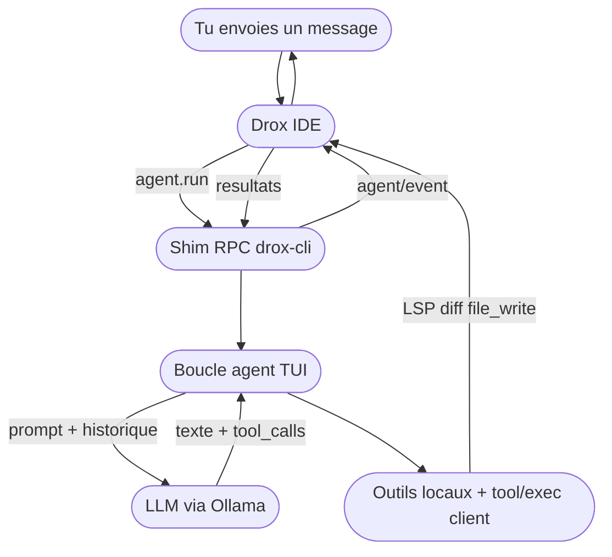
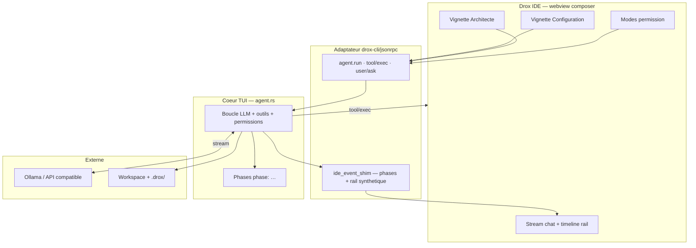
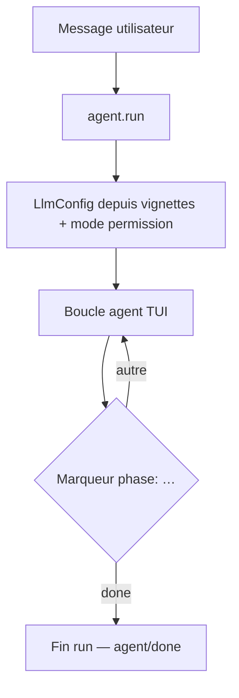
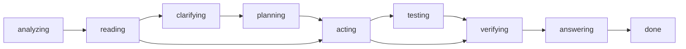
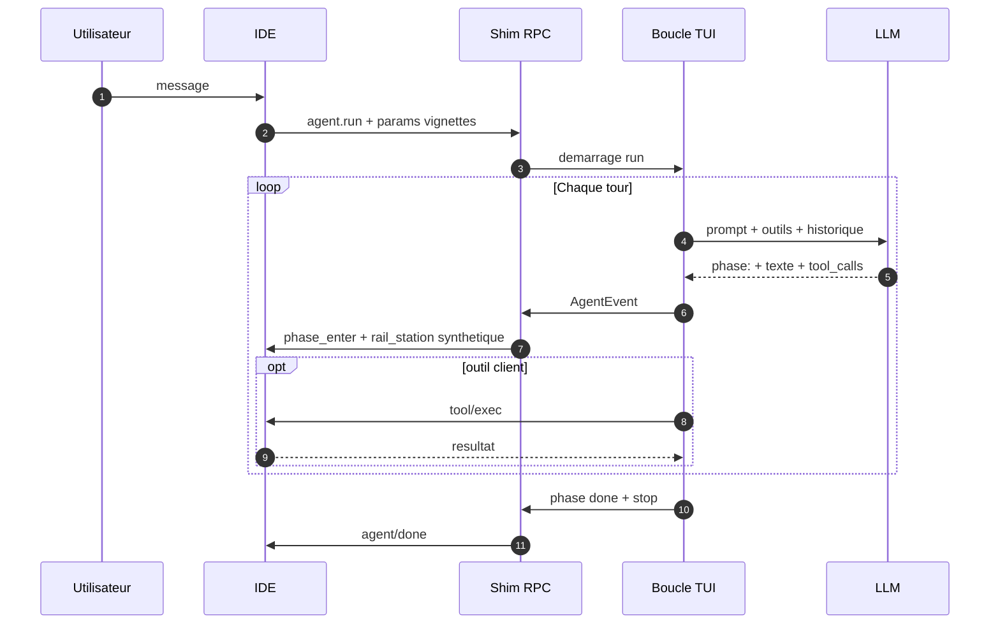
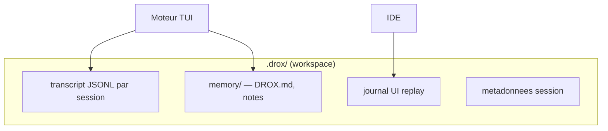

# Drox IDE — releases officielles

## But du projet — souveraineté et feuille de route

### Où en est Drox (1.5.x)

Le projet est en phase de **construction et de stabilisation de la base moteur** : mono-boucle TUI (`tui_mono`), shim RPC IDE, chat aligné sur le fil agent, wizard de connexion LLM. La release courante [**1.5.1**](https://github.com/DroxKiwi/Drox---IDE---OR/releases/latest) consolide cette fondation ; les prochaines (**1.5.2**, **1.5.3**) peaufinent l’UX et la distribution. Toujours **expérimental** — pas un IDE agent de production.

### Souveraineté

Drox vise la **souveraineté numérique** : IDE et moteur agent en local, LLM via **Ollama** (ou API que tu configures), données de session dans **`.drox/`** sur ton disque — pas de compte cloud KDDS obligatoire, pas de télémétrie Microsoft dans l’installeur.

**Seule exception réseau** : la **vérification de version** (lecture de `stable/latest.json` sur ce dépôt) pour proposer une MAJ si une release plus récente existe. Rien d’autre n’est requis pour coder avec l’agent.

### Vision produit

Permettre de **maîtriser des projets volumineux** avec une **IA légère** (modèles locaux ou petits modèles distants) — peu gourmande en RAM/VRAM et en tokens. Comprendre d’abord (carte du repo, parcours des fichiers), agir ensuite, avec **observabilité locale** pour rester maître du système.

### Pistes à venir (brainstorm)

Fiches d’intention dans le dépôt sources [Drox---IDE](https://github.com/DroxKiwi/Drox---IDE) — [index brainstorm](https://github.com/DroxKiwi/Drox---IDE/blob/main/drox-engine/docs/feature-brainstorm/README.md) :

| Thème | Objectif |
|-------|----------|
| **Télémétrie locale** | KPI par run/cycle, dashboards **100 % locaux** (`.drox/`) — aucun cloud |
| **Cartographie & parcours fichiers** | Vue graphe du parcours modèle ; rôles « compréhension » avant mutation |
| **IA légère & perf** | Réponses rapides sans sur-planifier ; backends distincts par rôle |
| **Sessions & long run** | Gros chantiers multi-heures ; reprise historique progressive |
| **Réglages & confiance** | Strictesse prompts, benchmark matériel/modèle, persona onboarding |
| **IDE & transparence** | Preview web, chassis Agents Window Drox, sortie shell live |

Ces pistes **ne bloquent pas** les releases courantes ; elles nourrissent la ligne **1.5.x+** et au-delà.

---

## ⚠️ STATUT — version 1.5.1 (juin 2026)

> **Drox 1.5.1** : fil de chat aligné sur le TUI, wizard connexion IA, replay session — toujours sur la base moteur **1.5.0** (`tui_mono`).  
> Toujours **expérimental** — pas un IDE agent de prod.

| | |
|---|---|
| **Version** | [**1.5.1**](https://github.com/DroxKiwi/Drox---IDE---OR/releases/latest) (juin 2026) · socle VS Code **1.126.0** |
| **Plateformes** | **Windows** (installeur) · **Linux** prévu **1.5.3** |
| **Utilisable au quotidien ?** | **Non** — early adopters / dogfood. |
| **Nouveautés 1.5.1** | Fil chronologique type TUI · wizard « Connect your AI » · `ask_user` markdown · UI chat en anglais. |
| **1.4.x** | **Obsolète** — ne plus documenter ni bâtir dessus. |

**En bref** : *même moteur stable qu’en 1.5.0, UX chat enfin alignée sur le TUI.*

---

**Ce dépôt** : binaires Windows, manifestes MAJ (`stable/latest.json`), notes de version.  
**Pas les sources** — moteur & branding propriétaires [KDDS](https://github.com/DroxKiwi). Socle IDE : Code OSS (MIT) — [NOTICE.md](NOTICE.md).

**Dernière version** : [1.5.1](https://github.com/DroxKiwi/Drox---IDE---OR/releases/latest) · notes [RELEASE_NOTES](stable/1.5.1/RELEASE_NOTES.md)

| | |
|---|---|
| Installer | [Télécharger](https://github.com/DroxKiwi/Drox---IDE---OR/releases/latest) |
| MAJ auto | `stable/latest.json` |
| Ollama (recommandé) | [ollama.com](https://ollama.com/) |
| SmartScreen | Installeur **non signé** — « Éditeur inconnu » au premier lancement (normal) |

---

## FR — Vue globale

Tu installes **Drox IDE**, tu fais tourner **Ollama** avec un modèle (Qwen, Gemma, etc.), tu ouvres ton projet. Quand tu écris dans **Drox Chat**, l’IDE parle au moteur **`drox.exe`** en local ; le moteur appelle ton modèle et te redemande l’IDE pour ce qu’il ne peut pas faire seul (LSP, diff, écriture fichier côté workspace, questions bloquantes).

**La pile**

**Un message dans le chat**

| Brique | Rôle |
|--------|------|
| **Ollama** | Inférence locale — le modèle que **tu** choisis |
| **drox.exe** | Mono-boucle agent TUI + shim JSON-RPC vers l’IDE |
| **Drox IDE** | Éditeur + chat + exécution outils « client » dans le workspace |
| **Toi** | Repo, modèle, vignettes Config / Architecte, mode permission |

Pas de compte cloud KDDS obligatoire. Données session dans **`.drox/`** sur ton disque.

---

## FR — Architecture 1.5.0 : trois couches

Le produit = **IDE Electron** + **moteur Rust** séparés. Le moteur 1.5 n’est **plus** le conducteur rail 1.4 : c’est la boucle TUI d’origine, avec un **adaptateur** pour parler au chat existant.

| Couche | Responsabilité |
|--------|----------------|
| **IDE** | UI chat, lance `drox --serve`, exécute LSP/diff/`file_write` client, affiche le stream. **Ne pilote pas** la logique agent. |
| **Shim RPC** | Traduit `AgentRunParams` (vignettes) → `LlmConfig` + `PermissionMode` ; relaie les events TUI ; synthétise `rail_station_*` pour la timeline. |
| **Cœur TUI** | Tours LLM, protocole `[phase: …]`, outils, permissions, session, compaction. Pipeline `tui_mono` — **pas** de `role_split`. |
| **Ollama** | Inférence. Le moteur envoie prompts + schémas outils ; reçoit tokens + `tool_calls`. |

Connexion IDE ↔ moteur : **pipe stdio**, messages **NDJSON** (JSON-RPC + events `agent/event`).

---

## FR — Un message → un run (`tui_mono`)

Chaque envoi déclenche **`agent.run`**. Le moteur exécute **une seule boucle** — plus de routage discuss/edit 1.4, plus d’intent probe, plus d’orchestration multi-rôles.

**Modes permission** (vignettes chat) — mappés côté moteur :

| Vignette IDE | `PermissionMode` moteur |
|--------------|-------------------------|
| Analyze | `plan` (lecture / conseil, écritures bloquées) |
| Trust edit | `acceptEdits` (mutations auto-autorisées) |
| I'm not crazy | `default` (allow / ask / deny) |

Les champs RPC hérités 1.4 (`orchestrationMode`, `architectInteractionMode`) sont **ignorés** par le moteur 1.5.

---

## FR — Phases agent (moteur réel)

Le modèle structure son travail avec des lignes **`[phase: nom]`**. Seul **`[phase: done]`** clôt le run. Le texte sous **`[phase: answering]`** est la réponse visible ; le reste alimente **Thinking** / blocs repliés.

Les phases intermédiaires sont **optionnelles** ; le chemin dépend de la tâche. Boucles `(acting → verifying)+` possibles avant la réponse finale.

**Timeline rail dans l’IDE** : le shim **`ide_event_shim`** projette les phases TUI en stations `read` / `propose` / `plan` / `act` / `verify` / `answer` — **affichage uniquement**, pas un conducteur moteur comme en 1.4.

---

## FR — Garde-fous

| Mécanisme | Effet |
|-----------|--------|
| `PermissionMode` | `plan` / `acceptEdits` / `default` / hooks |
| Permissions chemins + bash | Allow / ask / deny sur le workspace |
| `[phase: done]` | Clôture explicite du run |
| Compaction contexte | Snip / résumé quand la fenêtre LLM déborde |
| `maxIterations` | Plafond de tours (vignette Configuration) |

**Retiré avec la 1.4.x** : run rail observateur, ACL par station, `tool_folders`, `delegate_executor`, intent probe, `internal_plan_write` moteur 1.4, orchestration `role_split`.

---

## FR — Persistance session

---

## FR — Ce que le produit n’est pas

| Pas | Détail |
|-----|--------|
| IDE agent « prod » | Toujours expérimental — mais base 1.5 bien plus saine que 1.4 |
| Moteur 1.4.x | Rail observateur **obsolète** — archivé |
| Index sémantique / graphe | Piste 1.5.2+ |
| Linux `.deb` | Prévu **1.5.3** |
| Signature Authenticode | Prévu **1.5.3** |
| Code source moteur ouvert | — |

---

## EN — Project goal — sovereignty and roadmap

### Where Drox stands (1.5.x)

The project is in a **build and engine-stabilization** phase: TUI mono-loop (`tui_mono`), IDE RPC shim, agent-stream-aligned chat, LLM connection wizard. Current release [**1.5.1**](https://github.com/DroxKiwi/Drox---IDE---OR/releases/latest) consolidates that foundation; upcoming **1.5.2** and **1.5.3** refine UX and distribution. Still **experimental** — not a production agent IDE.

### Sovereignty

Drox aims for **digital sovereignty**: local IDE and agent engine, LLM via **Ollama** (or an API you configure), session data in **`.drox/`** on your disk — no mandatory KDDS cloud account, no Microsoft telemetry in the installer.

**Only network exception**: **version check** (reading `stable/latest.json` on this repo) to offer an update when a newer release exists. Nothing else is required to work with the agent.

### Product vision

**Master large codebases** with **lightweight AI** (local or small remote models) — low RAM/VRAM and token use. Understand first (repo map, file traversal), act second, with **local observability** so you stay in control.

### Upcoming themes (brainstorm)

Intent notes live in the source repo [Drox---IDE](https://github.com/DroxKiwi/Drox---IDE) — [brainstorm index](https://github.com/DroxKiwi/Drox---IDE/blob/main/drox-engine/docs/feature-brainstorm/README.md):

| Theme | Goal |
|-------|------|
| **Local telemetry** | Per-run/cycle KPIs, **100 % local** dashboards (`.drox/`) — no cloud |
| **Mapping & file traversal** | Model path graph; “understanding” roles before mutation |
| **Lightweight AI & perf** | Fast replies without over-planning; per-role inference backends |
| **Sessions & long run** | Multi-hour work; progressive history resume |
| **Settings & trust** | Prompt strictness, hardware/model benchmarks, onboarding persona |
| **IDE & transparency** | Web preview, Drox Agents Window shell, live shell output |

These themes **do not block** current releases; they feed **1.5.x+** and beyond.

---

## EN — Status (1.5.1)

> **Drox 1.5.1** : TUI-aligned chat timeline, AI connection wizard, session replay — still on **1.5.0** engine (`tui_mono`).  
> Still **experimental** — not a production daily driver.

| | |
|---|---|
| **Version** | [**1.5.1**](https://github.com/DroxKiwi/Drox---IDE---OR/releases/latest) (June 2026) · VS Code base **1.126.0** |
| **Platforms** | **Windows** installer · **Linux** planned **1.5.3** |
| **Daily driver?** | **No** — early adopters / dogfood. |
| **1.5.1 highlights** | Chronological TUI-style stream · « Connect your AI » wizard · markdown `ask_user` · English chat UI. |
| **1.4.x** | **Obsolete** — do not build on it. |

**In short**: *same stable engine as 1.5.0, chat UX finally matches the TUI.*

---

## EN — Overview

Install **Drox IDE**, run **Ollama**, open your project. **Drox Chat** talks to local **`drox.exe`** over stdio NDJSON; the engine calls your model and asks the IDE back for client-side work (LSP, diffs, workspace file writes, blocking questions).

**The stack** — same coarse diagrams as FR: IDE ↔ `drox.exe` ↔ Ollama, with the **RPC shim** between IDE wire format and the **TUI agent loop**.

| Piece | Role |
|-------|------|
| **Ollama** | Local inference — your chosen model |
| **drox.exe** | TUI mono-loop agent + JSON-RPC shim to the IDE |
| **Drox IDE** | Editor + chat + client tool execution |
| **You** | Repo, model, Config / Architect vignettes, permission mode |

No mandatory KDDS cloud. Session data in **`.drox/`** on disk.

---

## EN — Architecture 1.5.0: three layers

**Electron IDE** + **Rust engine**. Engine 1.5 is **not** the 1.4 rail conductor: it is the original TUI loop with an **adapter** for the existing chat UI.

1. **IDE** — chat webview, spawns `drox --serve`, runs client tools, renders stream. Does **not** drive agent logic.  
2. **RPC shim** (`drox-cli/jsonrpc`) — maps vignette params → `LlmConfig` + `PermissionMode`; relays TUI events; synthesizes `rail_station_*` for the timeline.  
3. **TUI core** (`agent.rs`) — LLM turns, `[phase: …]` protocol, tools, permissions, session. Pipeline **`tui_mono`** — no `role_split`.

---

## EN — One message → one run

Each send triggers **`agent.run`** → single **TUI loop**. No 1.4 discuss/edit routing, no intent probe, no multi-role orchestration.

Permission vignettes map to engine modes: **Analyze** → `plan`, **Trust edit** → `acceptEdits`, **I'm not crazy** → `default`. Legacy RPC fields (`orchestrationMode`, `architectInteractionMode`) are **ignored**.

Phases: `analyzing` → `reading` → optional `clarifying` / `planning` → `acting` → `testing` / `verifying` → `answering` → **`done`**. Only **`[phase: done]`** ends the run. **`answering`** text is the visible chat reply.

The IDE rail timeline is **synthetic** (`ide_event_shim`) for display — not a 1.4-style engine conductor.

---

## EN — Guardrails & session

Same as FR: `PermissionMode`, path/bash permissions, explicit `done`, context compaction, `maxIterations`. **Removed with 1.4.x**: observer rail, per-station ACL, `tool_folders`, `delegate_executor`, intent probe, 1.4 `internal_plan_write`, `role_split`.

`.drox/` holds JSONL transcript, UI replay journal, memory files.

---

## EN — What the product is not

| Not | Detail |
|-----|--------|
| Production agent IDE | Still experimental — 1.5 foundation is much healthier than 1.4 |
| 1.4.x engine | Observer rail **obsolete** — archived |
| Semantic index / graph | Planned 1.5.2+ |
| Linux `.deb` | Planned **1.5.3** |
| Authenticode signing | Planned **1.5.3** |
| Open engine source | — |

---

## Liens / Links

| FR | EN |
|----|-----|
| [NOTICE.md](NOTICE.md) | License & attributions |
| [stable/1.5.1/RELEASE_NOTES.md](stable/1.5.1/RELEASE_NOTES.md) | Release notes |
| [stable/1.5.0/RELEASE_NOTES.md](stable/1.5.0/RELEASE_NOTES.md) | Previous release |
| [Issues](https://github.com/DroxKiwi/Drox---IDE---OR/issues) | Install & update issues |
| Sources (privé) | Branche `1.5.0` sur dépôt KDDS |

---

*KDDS — Drox IDE. Built on Code OSS. Engine & branding proprietary.*
